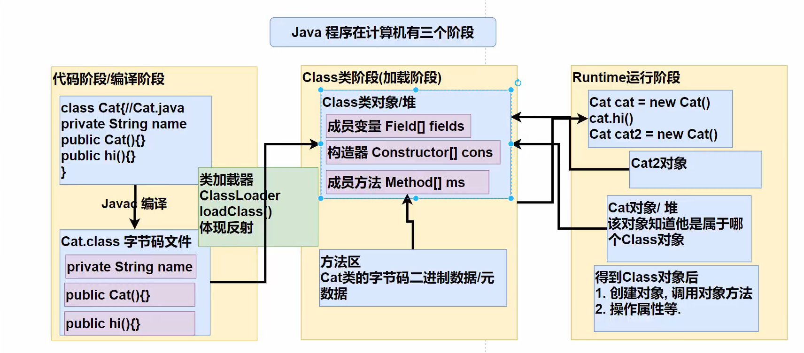
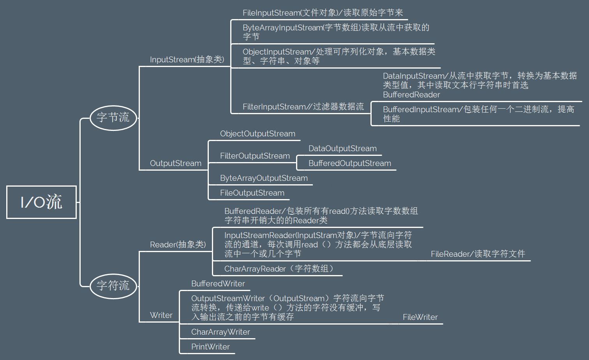
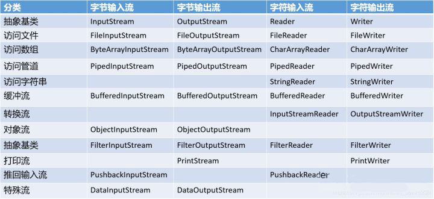

前言：

写出本文档的用意在于部分初学java的新手对晦涩难懂的java中文API无从下手
现有中文API基本是机翻的难以看懂所以有了此文，收录了java8的部分常用API
部分资料源于网络
（读到最后会因为网页限制不能显示所有内容，下载此项目即可查看后续）

建议下载后使用Typora查看

共两种阅读方式

1.学习路线：建议按照标题序号顺序查看

2.查字典路线：建议按照包分类查看


java类用法

## Ⅰ `java.lang`包中的类

`java.lang`包是java中的核心包在此包中的类无需导入即可使用

### 1、String类

位于`java.lang`包中，使用时无需导入

String类是不可变字符串,在字符串拼接时会产生多个对象，在服务器上使用时，拼接字符串的时候，为了节省内存应该使用StringBuilder类或StringBuffer类拼接字符串，因为他们不会创建新对象因此可以节省内存

#### 1.1 创建对象

```java
//第一种方式
String str=new String("你好");
//第二种方式
String str="你好";
//其他方式
String str="你"+"好";
```

#### 1.2 String方法

1.2.1 字符串比较（equals方法 equalsIgnoreCase方法）

```java
//因为直接用==比较的是对象地址，所以比较时可能字符串相同但是内存地址不同而出错，所以要使用equals
String str1="你好";
String str2="你不好";
System.out.println(str1.equals(str2));

//把英文忽略大小写比较
String str1="HELLO";
String str2="hello";
System.out.println(str1.equalsIgnoreCase(str2));  //把str1和str2忽略大小写比较
```

```java
false
true
```

##### 1.2.2 字符串提取（charAt方法 substring方法 ）

```java
//传入参数：下标（索引），从0开始
//单个字符串
String str1="你好,你今天吃饭了吗";
System.out.println(str1.charAt(5));   //获取str1下标为5的字

//多个字符串
//截取str1中从下标为5的字符开始到末尾，因为String不可变，所以用str4接收截取后的字符串
String str2=str1.substring(5); 
//截取str1中从下标为5的字符开始到下标为7的字符串（不包括下标为7的字符串）
String str3=str1.substring(5,7);
System.out.println(str2);
System.out.println(str3);
```

```java
天    //返回str1字符串的第六个字
    
天吃饭了吗  //从第六个字到末尾
天吃      //从第六个字到第7个字
```

##### 1.2.3字符串长度（length方法）

```java
//不需要传参
String str1="你好,你今天吃饭了吗";
System.out.println(str1.length());   //返回str1字符串的长度（汉字个数）
```

```java
10
```

##### 1.2.4 字符串查找（indexOf方法）

```java
//传入参数：要查找的字符串（数字……）
String str1="HELLO WORD";
String str2="WORD";
System.out.println(str1.indexOf(str2));   //在str1中查找str2得位置
```

```java
6    //反回str1中str2第一个字（W）的下标,没有找到返回-1
```

##### 1.2.5 字符串替换（replace方法）

```java
//传入参数： str1 原字符串   str2要替换的字符串
//把str1中的空格替换为-
String str1="HELLO WORD";
String str2=" ";
String str3="-";
//对str1进行替换 把str1中的str2替换成str3，因为String不可变，所以用str4接收改变后的字符串
String str4=str1.replace(str2,str3); 
System.out.println(str4);
```

```java
HELLO-WORD 
```

##### 1.2.6 比较开5头和结尾（startsWith方法 endsWith方法）

```java
//  串入参数：str2 ，str3 要比较的字符串
String str1="HELLO WORD";
String str2="HEL";
String str3="RD";
System.out.println(str1.startsWith(str2));  //比较str1是否以str2开头
System.out.println(str1.endsWith(str3));    //比较str1是否以str3结尾
```

##### 1.2.7 大小写转化（toLowerCase方法toUpperCase方法）

```java
//大写转小写 传入参数：不可修改 Locale.ROOT （系统语言设置）
String str1="HELLO WORD";
String str3=str1.toLowerCase(Locale.ROOT);  //把str1转化为小写的结果存在str3里
System.out.println(str3);

//小写转大写
String str2="hello word";
String str4=str2.toUpperCase(Locale.ROOT);  //把str1转化为小写的结果存在str4里
System.out.println(str4);
```

```java
hello word
HELLO WORD
```

##### 1.2.8 去除首尾空格

```java
//无须传参
String str1="     你好     ";
String str2=str1.trim();   //去除str1里的空格,因为String不可变，所以用str2接收改变后的字符串
System.out.println(str2);
```

```java
你好   //结果无空格
```


### 2 StringBuilder类

位于`java.lang`包中，使用时无需导入

 StringBuilder是可变的字符串序列

且线程不安全但效率高

#### 2.1 创建类对象 

```java
//创建StringBuilder对象时将String对象传入转化为StringBuilder对象
StringBuilder str01=new StringBuilder("你好");
//StringBuilder对象可直接打印
System.out.println(str01);   
```

```java
你好
```

#### 2.2 StringBuilder类方法

##### 2.2.1 修改StringBuilder对象

```java
//StringBuilder对象.setCharAt(字符串下标，要改成的值)
StringBuilder str02=new StringBuilder("你好");
 str02.setCharAt(0, '他');  //替换的值必须是char类型
System.out.println(str02);
```

```java
他好
```

##### 2.2.2 向StringBuilder对象增加字符

```java
//StringBuilder对象.append(要增加的字符串)
StringBuilder str02=new StringBuilder("他好");
str02.append("的很");   //传入字符串或其他类型
 System.out.println(str02);
```

```java
他好的很
```

##### 2.2.3 将StringBuilder对象改为倒序

```java
// 无需传参 StringBuilder对象.reverse()
StringBuilder str02=new StringBuilder("他好");
str02.reverse();  //倒转 str02
System.out.println(str02);
```

```java
好他
```

##### 2.2.4 向StringBuilder对象插入字符串

```java
//  StringBuilder对象.(插入位置下标，插入字符串)
StringBuilder str02=new StringBuilder("没钱");
str02.insert(1,"有");    //向没和钱中间加入有
System.out.println(str02);

//链式调用
StringBuilder str03=new StringBuilder("没钱");
str03.insert(1,"有").insert(2,"1").insert(2,"3");  //对str03连续使用insert插入字符
System.out.println(str03);
```

```java
没有钱
没有31钱
```

##### 2.2.5 删除StringBuilder对象中的某几个值

```java
// StringBuilder对象.delete(开始下标，结束下标)
StringBuilder str02=new StringBuilder("没钱");
str02.delete(1,2);    //删除str02下标1到下标2的字符串（不包括下标2）
System.out.println(str02);
```

```java
没
```


##### 2.x 其他方法和string类一样

同样用法的方法有

字符串查找（indexOf方法）

字符串提取（charAt方法substring方法 ）

字符串长度（length方法）……


### 3 StringBuffer类

位于`java.lang`包中，使用时无需导入

StringBuffer是可变的字符串序列

且线程安全但效率低

#### 3.1创建类对象

```java
//创建StringBuffer对象时将String对象传入转化为StringBuffer对象
StringBuffer str01=new StringBuffer("你好");
//StringBuffer对象可直接打印
System.out.println(str01);
```

```java
你好
```

#### 3.2 StringBuffer对象方法法

##### 3.2.1 修改StringBuffer对象

```java
//StringBuffer对象.setCharAt(字符串下标，要改成的值)
StringBuffer str01=new StringBuffer("你好");
 //替换的值必须是char类型 
str01.setCharAt(0, '我'); //把你替换成我
System.out.println(str01);
```

```java
我好
```

##### 3.2.2 向StringBuffer对象增加字符

```java
//StringBuffer对象.append(要增加的字符串)
StringBuffer str01=new StringBuffer("你好");
str01.append("吗");    //传入字符串或其他类型
System.out.println(str01);
```

```java
你好吗
```

##### 3.2.3 StringBuffer对象改为倒序

```java
// 无需传参 StringBuffer对象.reverse()
StringBuffer str01=new StringBuffer("你好");
str01.reverse();  //把str01倒转
System.out.println(str01);
```

```java
好你
```

##### 3.2.4  向StringBuffer对象插入字符串

```java
//  StringBuffer对象.(插入位置下标，插入字符串)
StringBuffer str01=new StringBuffer("没朋友");
str01.insert(1,"女");  //在没和朋中间插入女
System.out.println(str01);

//链式调用
StringBuffer str04=new StringBuffer("没朋友");
str04.insert(1,"女").insert(1,"啥");  //对str04连续调用insert方法插入值
System.out.println(str04);
```

```java
没女朋友
没啥女朋友
```

##### 3.2.5 删除StringBuffer对象中的某几个值

```java
//StringBuffer对象.delete(开始下标，结束下标)
StringBuffer str01=new StringBuffer("没朋友");
str01.delete(1,2);     //删除str02下标1到下标2的字符串（不包括下标2）
System.out.println(str01);
```

```java
没友
```


##### 3.x  其他方法和string类一样

同样用法的方法有

字符串查找（indexOf方法）

字符串提取（charAt方法substring方法 ）

字符串长度（length方法）……


### 7 Math类

位于`java.lang`包中，使用时无需导入

#### 7.1Math类方法

##### 7.1.1向上取整

转化为整数

```java
//传参  浮点数
System.out.println(Math.ceil(3.2));    //把3.2向上取整
```

```java
4.0
```

##### 7.1.2向下取整

转化为整数

```java
//传参 浮点数
System.out.println(Math.floor(3.26));  //把3.26向下取整
```

```java
3
```

##### 7.1.3 四舍五入

```java
//传参 浮点数
System.out.println(Math.round(3.6));  //把3.6进行四舍五入的运算
System.out.println(Math.round(3.2));  //把3.6进行四舍五入的运算
```

```java
4
3
```

##### 7.1.4绝对值

```java
//传参：任意数字类型参数
System.out.println(Math.abs(-5));  //对-5取绝对值
```

```java
5
```

##### 7.1.5 开平方

```java
//传参：要开平方的数
System.out.println(Math.sqrt(9));   //对9开平方
```

```java
3.0
```

##### 7.1.6 幂运算

```java
// 要进行幂运算的数，进行多少次方运算
System.out.println(Math.pow(4,3));   //运算4的3次方
```

```java
64.0
```

##### 7.1.7 常量

```JAVA
System.out.println(Math.PI); //  π
System.out.println(Math.E);  //e
```

```java
3.141592653589793
2.718281828459045
```

##### 7.1.8  0-1随机数

```java
//无需传参 
System.out.println(Math.random());    //获得0-1之间的随机浮点数（结果包括0不包括1）
```

```java
0.5604021802601352
```

### 20 枚举类

所有枚举类都隐性继承自`java.lang.Enum`类，实质上还是类，枚举值都默认被public static final修饰，可以直接通过枚举类名使用它们

#### 20.1创建枚举类

```java
//实例   enum 枚举类名{枚举1，枚举2，枚举3…… }
enum week{MON,TUE,WED,THUR,FRI,SAT,SUN}
```


### 21 java异常类(Exception)

在java中所有的异常类都继承自Throwable,直接继承Throwable类的有Error类和Exception类在他们之下还分出许多的异常类

关系如图所示（下图没有列出所有异常类）


在这之中Error异常是由于JVM（java虚拟机）错误引起的，大多数时候与程序的编写者执行的操作无关，这类错误是不能进行处理的，一旦出现这类错误JVM会停止运行

**异常分类**

非检查类异常(Unchecked Exception)

在集成开发环境（Intellij IDEA、eclipse等）中不会给出提示的错误，这类异常一般可以自行避免，不处理也能进行编译

| 常见非检查类异常                | 描述                                                         |
| ------------------------------- | ------------------------------------------------------------ |
| ArithmeticException             | 当出现异常的运算条件时，抛出异常。例如，一个整数“除以零”时，抛出此类的一个实例。 |
| ArrayIndexOutOfBoundsException  | 用非法索引访问数组时跑出的异常。如果索引为负或大于等于数组大小，则该索引为非法索引。 |
| ArrayStoreException             | 试图将错误类型的对象存储到一个对象数组时，抛出的异常。       |
| ClassCastException              | 试图将对象强制转换为不是同一个类型或其子类的实例时，抛出的异常。 |
| llegalArgumentException         | 当向一个方法传递非法或不正确的参数时，抛出该异常。           |
| llegalMonitorStateException     | 当某一线程已经试图等待对象的监视器，或者通知其他正在等待该对象监视器的线程，而该线程本身没有获得指定监视器时抛出该异常。 |
| llegalStateException            | 在非法或不适当的时间调用方法时产生的信号。或者说Java环境或应用程序没有处于请求操作所要求的适当状态下。 |
| IllegalThreadStateException     | 线程没有处于请求操作所要求的适当状态时，抛出该异常。         |
| IndexOutOfBoundsException       | 当某种排序的索引超出范围时抛出的异常，例如，一个数组，字符串或一个向量的排序等。 |
| NegativeArraySizeException      | 如果应用程序试图创建大小为负的数组时，抛出该异常。           |
| NullPointerException            | 当应用程序在需要操作对象的时候而获得的对象实例是null时抛出该异常。 |
| NumberFormatException           | 当应用程序试图将字符串转换成一种数值类型，但该字符串不能转换为适当格式时，抛出该异常。 |
| SecurityException               | 由安全管理器抛出的异常，指示存在安全侵犯。                   |
| StringIndexOutOfBoundsException | 此异常由String方法抛出，说明索引为负或者超出了字符串的大小。 |

检查类异常(Checked Exception)

在集成开发环境（Intellij IDEA、eclipse等）中会给出提示的错误，不处理不能进行编译

| 常见检查类异常             | 描述                                                         |
| -------------------------- | ------------------------------------------------------------ |
| ClassNotFoundException     | 当应用程序试图加载一一个类，通过名字查找时却发现没有该类的定义时，抛出该异常。 |
| CloneNotSupportedException | 当去克隆一个对象时，发现该对象没有实现Cloneable接口时，抛出该异常。 |
| llegalAccessException      | 当应用程序尝试通过反射的方式来访问类、成员变量或调用方法时，却无法访问这些类、成员变量或方法的定义时，抛出该异常。 |
| InstantiationException     | 当试图使用Class类中的newInstance方法创建一个类的实例， 而制定的类对象因为是一个接口或是一个抽象类而无法实例化时，抛出该异常。 |
| InterruptedException       | 一个线程被另一个线程中断时，抛出该异常。                     |
| NoSuchFieldException       | 当找不到指定的变量字段时，抛出该异常、                       |
| NoSuchMethodException      | 当找不到指定的类方法时，抛出该异常。                         |

Exception异常及其子类异常是可以通过异常处理解决的，下面介绍具体方法

#### 21.1 使用try{}catch(){}方法处理异常

使用 `try{……}catch(){……}finally{}`语句处理异常，可能有多种异常时可在`catch(){……}`后面再加几个`catch(){……}`

```java
try {
可能出现异常的代码
}catch (可能发生的异常类型a  异常对象){   
        发生异常a的处理方法    
}catch (可能发生的异常类型b 异常对象){
        发生异常b的处理方法   
}finally {
    无论是否异常都会在最后执行        
}
```

使用时要注意以下几点

1. try块中的局部变量和catch块中的局部变量（包括异常变量），以及finally中的局部变量，他们之间不可共享使用。

2. catch块从上向下匹配 只有第一个被匹配的块会被执行 且父类异常类也能匹配子类的异常对象

   假设一个异常处理块有两个catch块 第一个catch块匹配Exception类异常对象进行处理 第二个catch块匹配ArithmeticException异常对象进行处理那么第二个catch块的ArithmeticException异常对象永远不会被匹配到，因为ArithmeticException类是Exception类的子类，即使发生了ArithmeticException异常也会被写在第一个catch块的Exception类匹配，正确写法是把异常类的子类写在上面，即第一个catch块匹配ArithmeticException异常对象并处理，第二个catch块对Exception类异常对象匹配并处理

3. finally块不是必须的，通常是可选的。

   finally主要做一些清理工作，如流的关闭，数据库连接的关闭等。

   一个try至少要有一个catch块，否则， 至少要有1个finally块。但是finally不是用来处理异常的，finally不会捕获和处理异常，处理异常的只能是catch块。

   finally块不管异常是否发生，只要对应的try执行了，则它一定也执行。只有一种方法让finally块不执行：`System.exit()`

   建议大家养成在try块中打开资源在finally块中关闭资源的好习惯
   
   #### 21.2 使用throws抛出方法
   
   可在定义方法时使用throws抛出异常具体使用方法如下
   
   ```java
   //定义一个方法
   void Test01() throws Exception{   //使用throws抛出Exception异常   在调用此方法时需要进行异常处理
     可能会出现异常的代码
   }
   ```
   
   #### 21.3 自定义异常
   
   在定义异常时可继承Exception和RuntimeException异常，继承Exception类的为检查类异常，RuntimeException类的为非检查类异常，在习惯上应该定义两个构造器一个默认构造器和一个详细的构造器
   


### 43.java反射机制



在创建某个类对象时在堆中会加载那个类的class对象（只加载一次），class对象包含了那个类的完整结构信息（类似于书的目录）

#### 43.1 class类

class对象的特点：

​		class对象也继承自 Object对象

​		class对象由系统创建，而不是new出来的

​		对于某个类的class对象在内存中只有一份

​		通过一·系列API可以得到类的完整结构

有class对象的类型：1 外部类、成员内部类、静态内部类、局部内部类、匿名内部类

​									2.interface（接口）

​									3.数组

​									4.enum（枚举）

​									5.annotation（注解）

​									6.基本数据类型

​									7.void

下面演示使用方法

##### 43.1.2获取class对象

有以下所示的几种方法

演示所使用的类所在的目录结构为`src/Test01/Cat.java`

```java
class Cat{
    public int age=10;
    public String name="宝马";
    int price=500000;

    public int getPrice() {
        return price;
    }
    public String toString() {
        return "Cat{" +
                "age=" + age +
                ", name='" + name + '\'' +
                ", price=" + price +
                '}';
    }
}
```

```java
//1 通过Class.forName()方法得到class对象
Class<?> cls=Class.forName("Test01.Cat");
System.out.println(cls);
//2 通过 类名.class 得到class对象
Class<Cat> cat01 = Cat.class;
System.out.println(cat01);
//3 通过 对象.getClass()方法得到class对象
Cat cat02 = new Cat();
Class cat03=cat02.getClass();
System.out.println(cat03);
//4通过类加载器得到class对象
//4.1先得到类加载器
Cat cat04 = new Cat();
ClassLoader loader=cat04.getClass().getClassLoader();
//4.2使用加载器的loadClass方法得到class对象
Class cls=loader.loadClass("java.lang.String");
System.out.println(cls);
//包装数据类型可以通过.TYPE获得基本数据类型的class对象
Class<Integer> type = Integer.TYPE; //此方法得得到的Class对象与int.class得到的class对象相同
System.out.println(type); 
```

```java
class Test01.Cat
class Test01.Cat
class Test01.Cat
class java.lang.String
    int
```


##### 43.1.2使用方法

| 方法名                      | 说明                                                         |
| :-------------------------- | :----------------------------------------------------------- |
| forName()                   | 获取Class对象的一个引用，但引用的类还没有加载(该类的第一个对象没有生成)就加载了这个类。 (2)为了产生Class引用，forName()立即就进行了初始化。 |
| Object.getClass()           | 获取Class对象的一个引用，返回表示该对象的实际类型的Class引用。 |
| getName()                   | 获取全限定类名，jvm中Class的表示，可以用于动态加载Class对象，例如Class.forName。 |
| getSimpleName()             | 只获取类名 (不包括包名)                                      |
| getCanonicalName()          | 返回更容易理解的全限定类名，主要用于输出（toString）或log打印，大多数情况下和getName一样，但是在内部类、数组等类型的表示形式就不同了。 |
| isInterface()               | 判断Class对象是否是表示一个接口                              |
| getInterfaces()             | 返回Class对象数组，表示Class对象所引用的类所实现的所有接口。 |
| getAnnotations()            | 返回Annotation对象数组,表示Class对象所引用的类的所有注解     |
| getSupercalss()             | 返回Class对象，表示Class对象所引用的类所继承的直接基类。应用该方法可在运行时发现一个对象完整的继承结构。 |
| newInstance()               | 返回一个Oject对象，是实现“虚拟构造器”的一种途径。**使用该方法创建的类，必须带有无参的构造器**。 |
| getFields()                 | 返回一个Field数组，获得某个类的所有的公共（public）的字段，包括继承自父类的所有公共字段。 类似的还有getMethods和getConstructors。（字段又名属性） |
| getMethods（）              | 返回一个Method数组，获得某个类的所有的公共（public）的方法，包括继承自父类的所有公共方法。 |
| getConstructors（）         | 返回一个Constructor数组，获得某个类的所有的公共（public）的构造器，不包括继承自父类的所有构造器。 |
| getDeclaredFields（）       | 返回一个Field数组，获得某个类的自己声明的字段，即包括public、private和proteced，默认但是不包括父类声明的任何字段。类似的还有getDeclaredMethods和getDeclaredConstructors。 |
| getDeclaredMethods（）      | 返回一个Method数组，获得某个类的自己声明的方法，即包括public、private和proteced，默认但是不包括父类声明的任何方法 |
| getDeclaredConstructors（） | 返回一个Constructor数组，获得某个类的自己声明的构造方法，即包括public、private和proteced，不包括父类声明的任何构造方法 |

演示所使用的类所在的目录结构为`src/Test01/Cat.java`

```java
class Cat{
    public int age=10;
    public String name="宝马";
    int price=500000;

    public int getPrice() {
        return price;
    }
    public String toString() {
        return "Cat{" +
                "age=" + age +
                ", name='" + name + '\'' +
                ", price=" + price +
                '}';
    }
}
```

```java
//使用Class.forName方法传入String类的全类名得到String类的class对象，Class<?>尖括号中的问号代表任意类型，尖括号可以去掉（此示例使用String类做演示在实际使用时可改为其他类）
//得到class对象
Class<?> cls=Class.forName("Test01.Cat"); //得到String类的class对象
//输出cls
/*1*/System.out.println(cls); //输出cls是哪一个类的class对象
/*2*/System.out.println(cls.getClass()); //输出class是个什么类的对象（运行类型）
//获得包名
/*3*/System.out.println(cls.getPackage().getName());
//得到全类名
/*4*/System.out.println(cls.getName());
//创建类对象
Cat cat01= (Cat) cls.newInstance();//如果不进行强制转化通过newInstance方法创建的对象默认是Object对象，实际运行类型还是Cat对象
//jdk1.9以后的版本建议使用Cat cat01=(Cat) cls.getDeclaredConstructor().newInstance();获得Cat实例
/*5*/System.out.println(cat01);
//通过反射获取对象属性
Field age= cls.getField("age"); //获取class对象中的age属性，如果属性是私有的会报错
/*6*/System.out.println(age.get(cat01)); //使用 属性.get(对象)方法得到cat01对象中的age属性并输出
//通过反射修改对象的值
age.set(cat01,15);
/*7*/System.out.println(age.get(cat01));
//获得所有的对象属性
Field[] fie01 = cls.getFields();
/*8*/System.out.println(Arrays.toString(fie01));
```

```java
class Test01.Cat
class java.lang.Class
Test01
Test01.Cat
Cat{age=10, name='宝马', price=500000}
10
15
[public int Test01.Cat.age, public java.lang.String Test01.Cat.name]
```

#### 43.2 Field类

Field的对象是class对象使用getField或getFields方法得到的对象

每个Field对象都表示（关联）一个类的一个属性

下面进行演示，演示所使用的类

```java
class  Cat{
    public int age=10;
    public String name="宝马";
    int price=500000;
    private int hight=2;

    public Cat(int age, String name) {
        this.age = age;
        this.name = name;
    }

    Cat(int age, String name, int price) {
        this.age = age;
        this.name = name;
        this.price = price;
    }

    public int getPrice() {
        return price;
    }
    public String getCollection(int price){if(price>300000){return "高级";}else{return "普通";}}
    private int getNewPrice(int price,int age){return price/age;}
    public String toString() {
        return "Cat{" +
                "age=" + age +
                ", name='" + name + '\'' +
                ", price=" + price +
                '}';
    }
}

```

##### 43.2.1 方法 

##### 43.2.1.1获取Field对象

```java
//此处使用getField的方法得到Field对象
Class<?> cls=Class.forName("Test01.Cat"); //创建一个Cat类的class对象
Field fie=cls.getField("age"); //通过class对象创建一个age属性的Field对象，此方法只能获取public修饰的属性的Field对象
```

可用`getDeclaredField `方法获取非`public`修饰的属性的Field对象，用法与`getField`方法一致

##### 43.2.1.2获取Field对象修饰符（getModifiers）

该方法反回一个int值，其值的大小为该属性所有修饰符的值的和

默认修的值是0，public的值是1，private的值是2，protected的值是4，static的值是8，final的值是16

如果一个属性的修饰符是`public static`那么此方法的返回值就是9

```java
Class<?> cls= Class.forName("Test01.Cat");//创建一个Cat类的class对象
Field fie=cls.getField("age");//通过class对象创建一个age属性的Field对象
System.out.println(fie.getModifiers()); //输出age属性修饰符的值
```

```
1
```

##### 43.2.1.2获取Field对象的类型（getType方法）

以class对象的形式返回 Field对象的类型

```java
Class<?> cls= Class.forName("Test01.Cat");//创建一个Cat类的class对象
Field fie=cls.getField("age");//通过class对象创建一个age属性的Field对象
Class cls01=fie.getType();//age是int类型的，所以cls01是int的class对象
System.out.println(cls01); //输出class对象
```

```
int
```

##### 43.2.1.3获取Field对象对应的属性名（getName方法）

```java
Class<?> cls= Class.forName("Test01.Cat");//创建一个Cat类的class对象
Field fie=cls.getField("age");//获取属性age的Field对象
System.out.println(fie.getName());//输出Field对象对应属性名
```

```java
age
```

##### 43.2.1.3 获取Field对象对应的属性值（get方法）

```java
Class<?> cls= Class.forName("Test01.Cat");//创建一个Cat类的class对象
Field field01= cls.getDeclaredField( "age"); //获取属性age的Field对象
Object o = cls.newInstance(); //创建Cat对象
System.out.println(field01.get(o)); //通过Field对象使用get方法传入 Field对象对应的属性 所在的类对象获取Field对象对应的属性值（此处field01对象对应的属性是age，age所在的类是Cat所以传入cat对象即可）
```

```
10
```

##### 43.2.1.5 修改Field对象对应的属性值（set方法）

修改`public`属性

```java
Class<?> cls= Class.forName("Test01.Cat"); //创建一个Cat类的class对象
//得到Field对象
Field field01= cls.getField( "age");//获取属性age的Field对象
Object o = cls.newInstance();//创建一个Cat对象
//修改对象的值
field01.set(o,20);//对Field对象使用set方法，第一个传入要修改的对象第二个传入想要修改成的值（例如此处是想要把o对象的age值改为20），如果Field对象对应的属性修饰符为static
System.out.println(o);//输出修改后的对象
```

```
Cat{age=20, name='宝马', price=500000}
```

修改非`public`属性

```java
Class<?> cls= Class.forName("Test01.Cat");//创建一个Cat类的class对象
//得到Field对象
Field field01= cls.getDeclaredField( "hight");//使用getDeclaredField方法获取Field对象（hight属性由private修饰，使用getField方法不能获得Field对象）
Object o = cls.newInstance();//创建一个Cat对象
//修改对象的值
field01.setAccessible(true);//使用爆破，作用是使Field对象的set方法能够成功修改传入对象的值（如果不进行爆破，直接使用set方法修改对象的值会因为访问权限的问题报错）
field01.set(o,5);//第一个传入修改的对象第二个传入修改的值
System.out.println(field01.get(o));//输出对象o的age值
```

```
5
```


#### 43.3Method类

Method对象是class对象使用getMethod或getMethods方法得到的对象

每个Method对象都表示（关联）一个类的一个方法，演示所用的类与Field类相同

##### 43.3.1Method方法

##### 43.3.1.1创建Method对象

```java
Class<?> cls= Class.forName("Test01.Cat");   //创建class对象
Method field02= cls.getMethod("getCollection", int.class);//使用getMethod方法获得public修饰的方法的Method对象，第一个实参是方法名，后面的实参是调用getNewPrice方法需要传入形参类型的class对象（如果原方法无需传参则只传入方法名即可）
Method field01= cls.getDeclaredMethod("getNewPrice", int.class, int.class); //使用getDeclaredMethod方法获得public和非public修饰的方法的Method对象，第一个实参是方法名，后面的实参是调用getNewPrice方法需要传入形参类型的class对象（如果原方法无需传参则只传入方法名即可）
System.out.println(field02);
System.out.println(field01);
```

```java
public java.lang.String Test01.Cat.getCollection(int)
private int Test01.Cat.getNewPrice(int,int)
```

##### 43.3.1.2 获取Method对象修饰符（getModifiers）

作用与获取Field类的getModifiers方法相同（获取方法修饰符的值的和），修饰符值的定义与Field类的getModifiers方法相同

```java
Class<?> cls= Class.forName("Test01.Cat"); //创建class对象
Method met=cls.getMethod("toString"); //创建toString方法的Method对象
System.out.println(met.getModifiers());//获取修饰符的值
```

```java
1
```

##### 43.3.1.23获取方法的返回类型（getReturnType）

通过getReturnType方法可以获取返回值类型对应的class对象

```java
Class<?> cls= Class.forName("Test01.Cat"); //创建class对象
Method met=cls.getMethod("toString");//创建toString方法的Method对象
Class cls2=met.getReturnType(); //得到返回值对应类型的class对象
System.out.println(cls2); //输出class对象
```

```java
class java.lang.String //因为返回值是String类型的所以这里打印了String类型的class对象
```

##### 43.3.1.4  获取方法名（getName）

```java
Class<?> cls= Class.forName("Test01.Cat");//创建class对象
Method met=cls.getMethod("toString");//创建toString方法的Method对象
String cls2=met.getName(); //得到方法名
System.out.println(cls2); //打印方法名
```

```java
toString
```

##### 43.3.1.5 获取方法的形参（getParameterTypes）

该方法返回一个class数组，数组中包括所有形参类型的class对象

```java
Class<?> cls= Class.forName("Test01.Cat");//创建class对象
Method met=cls.getMethod("toString");//创建toString方法的Method对象
Class<?>[] cls2=met.getParameterTypes(); //获取toString方法所有形参的class对象的数组
System.out.println(Arrays.toString(cls2));//打印数组
```

```java
[]
```

##### 43.3.1.5 调用Method对象关联的方法

调用`public`修饰的方法

```java
Class<?> cls= Class.forName("Test01.Cat");//创建class对象
Method field02= cls.getMethod("getCollection", int.class); //通过class对象创建getCollection方法的Method对象
Object o = cls.newInstance(); //创建一个Cat对象
System.out.println(field02.invoke(o,400000));//对Method对象使用invoke方法调用Method对象关联的方法，传入的第一个值为Method对象关联的方法所在的类的对象（此处getCollection方法所在的了类为Cat类），后面的值为调用Method对象关联的方法所需要的实参
```

```java
高级
```

调用非`public`修饰的方法

```java
Class<?> cls= Class.forName("Test01.Cat");//创建class对象
Method field01= cls.getDeclaredMethod("getNewPrice", int.class, int.class);//通过class对象创建getCollection方法的Method对象
Object o = cls.newInstance();//创建一个Cat对象
field01.setAccessible(true); //进行爆破，作用是使Method对象可以正常使用invoke方法调用与Method对象关联的被非public修饰符修饰的方法
System.out.println(field01.invoke(o,400000,10));//调用方法输出返回值（当Method对象关联的是静态方法时，穿入的对象（即此处的o）可以为null）
```

#### 43.4 Constructor类

Constructor对象是class对象使用getConstructor（public构造方法）或getDeclaredConstructor（本类构造方法）方法得到的对象

每个Constructor对象都表示（关联）一个类的一个构造方法

演示所用的类与Field类相同

##### 43.4.1Constructor类方法

##### 43.4.1.1创建Constructor对象

获取无参构造器对象

```java
Class<?> cls= Class.forName("Test01.Cat"); //创建class对象
Constructor<?> met=cls.getDeclaredConstructor();//获取Cat类默认的无参构造方法对象（即Constructor对象），本次演示的无参构造器不带public(默认无参构造方法也不带public)，所以要用getDeclaredConstructor方法，否则会报错
String cls2=met.getName(); //获取方法名
System.out.println(cls2); //打印方法名
```

获取public有参构造器对象

```java
Class<?> cls= Class.forName("Test01.Cat"); //创建class对象
//得到构造器
Constructor<?> met=cls.getConstructor(int.class,String.class); //向getConstructor方法传入有参构造器形参类型的class对象即可得到该类的有参构造器，例如此处的构造器是 public Cat(int age, String name){……}形参是age和name他们的类型分别是int和String，向getConstructor方法传入int和String的class对象即可获得此构造器
//创建对象
Object cat01=met.newInstance(15,"五凌鸿光"); //通过newInstance方法传入public有参构造器需要的参数获得对象，cat01的运行类型是Cat
System.out.println(cat01);
```

```JAVA
Cat{age=15, name='五凌鸿光', price=500000}
```

获取非public有参构造器对象

```JAVA
Class<?> cls= Class.forName("Test01.Cat"); //创建class对象
//得到构造器
Constructor<?> met=cls.getDeclaredConstructor(int.class,String.class,int.class);//获取有参构造器，因为此构造方法是非public的所以要使用getDeclaredConstructor（传参规则与getConstructor相同）
//创建对象
met.setAccessible(true);//爆破，作用是使newInstance方法能够调用非public构造方法创建对象（如果不进行爆破，newInstance方法会因为不能调用非public的构造方法创建对象而报错）
Object cat01=met.newInstance(12,"大众",400000); //传入有参构造器需要的参数类型创建对象，cat01的运行类型是Cat
System.out.println(cat01);
```

```java
Cat{age=15, name='五凌鸿光', price=400000}
```

##### 43.4.1.2 获取Method对象修饰符（getModifiers）

此方法使用方法与Field类的getModifiers方法使用方式相同，修饰符对应的值也相同

```java
Class<?> cls= Class.forName("Test01.Cat"); //创建class对象
Constructor<?> met=cls.getDeclaredConstructor();  //创建Constructor对象
int cls2=met.getModifiers(); //获取无参构造方法的修饰符的值
System.out.println(cls2); //输出值
```

```java
0
```

##### 43.4.1.3 获取方法的形参（getParameterTypes）

该方法返回一个class数组，数组中包括所有形参类型的class对象

```java
Class<?> cls= Class.forName("Test01.Cat");//创建class对象
Constructor<?> met=cls.getDeclaredConstructor();//创建Constructor对象
Class<?>[] cls2 = met.getParameterTypes();//获取默认构造方法所有形参的class对象的数组
System.out.println(Arrays.toString(cls2));//打印class数组
```

```java
[]
```


## Ⅱ ` java.util`包中的类

### ~~4 Date类 （时间类）~~

用于表示时间的类在使用之前应该先进行导入`import java.util.Date;`

#### 4.1 创建Date类对象（时间类对象）

```java
// 不传参时默认表示现在时间
Date time01=new Date();      //创建现在的时间对象
System.out.println(time01);  //输出时间对象time01

//传入数字x表示 1970年一月一日0点后的第x毫秒的时间点

Date time02=new Date(10000);   //1970年一月一日8加上10000毫秒
System.out.println(time02);    //输出时间对象time02
```

```java
Sat Mar 26 16:12:33 CST 2022
Thu Jan 01 08:00:10 CST 1970    //因为电脑所设的时区是东8区 所以起始时间为8点
```

#### 4.2 Date类方法

起始计算时间为 1970.1.1 00：00：00

#####  4.2.1获得毫秒数(getTime)

```java
// 无需传参 Date对象.getTime()
Date time01=new Date();  //创建现在的时间对象
//获取1970.1.1 00：00：00到time01的时间
long lomg01=time01.getTime(); 
System.out.println(lomg01);
```

```java
1648284349568  //单位毫秒
```

##### 4.2.2 比较时间对象(after方法、before方法、equals方法）

```java
//   时间对象1.after(时间对象2)


//比较时间对象1是否在时间对象2后
Date time01=new Date(1000);  //1970.1.1 00：00：01
Date time02=new Date();  //现在时间
boolean lo02=time01.after(time02); //比较time01是否在time02后
System.out.println(lo02);

//比较时间对象1是否在时间对象2前
Date time01=new Date(1000);   //1970.1.1 00：00：01
Date time02=new Date();   //现在时间
boolean lo02=time01.before(time02);  //比较time01是否在time02前
System.out.println(lo02);

//比较时间对象1是否和间对象2相等
Date time01=new Date(1000);   //1970.1.1 00：00：01
Date time02=new Date();    //现在时间
boolean lo02=time01.equals(time02);  //比较time01是否和time02相等
System.out.println(lo02);
```

```java
false
true
false
```

##### 4.2.3 转化为Instant类对象(toInstant方法)

```java
//无需传参
Date time02=new Date(); // 创建Date对象
Instant time03=time02.toInstant();  //转化为Instant类对象
```


### 6  GregorianCalendar类（日期类）

GregorianCalendar类是Calendar抽象类的子类

使用此类之前应该先导入类

```java
import java.util.Calendar;
import java.util.GregorianCalendar;
```

#### 6.1 创建GregorianCalendar类

```java
//传入参数：年，月，日，时，分，秒  不传参默认设置为现在时间
Calendar time01=new GregorianCalendar(2022,5,26,20,23,0); //设置时间
System.out.println(time01);
```

```java
java.util.GregorianCalendar[time=?,areFieldsSet=false,areAllFieldsSet=false,lenient=true,zone=sun.util.calendar.ZoneInfo[id="Asia/Shanghai",offset=28800000,dstSavings=0,useDaylight=false,transitions=31,lastRule=null],firstDayOfWeek=1,minimalDaysInFirstWeek=1,ERA=?,YEAR=2022,MONTH=5,WEEK_OF_YEAR=?,WEEK_OF_MONTH=?,DAY_OF_MONTH=26,DAY_OF_YEAR=?,DAY_OF_WEEK=?,DAY_OF_WEEK_IN_MONTH=?,AM_PM=1,HOUR=8,HOUR_OF_DAY=20,MINUTE=23,SECOND=0,MILLISECOND=?,ZONE_OFFSET=?,DST_OFFSET=?]
```

各种参数详解

|      名称       | 含义                                                         |         名称         |                    含义                    |
| :-------------: | :----------------------------------------------------------- | :------------------: | :----------------------------------------: |
|      time       | 以1970年1月1日，格林尼治标准时间0:00:00开始到设定时间的毫秒数 |        MONTH         |   时间对象中的月份反回值为0-11，0为一月    |
|  areFieldsSet   | time域是否与field域同步                                      |     WEEK_OF_YEAR     |        时间对象表示的是当年的第几周        |
| areAllFieldsSet | time域是否与field域全部同步                                  |    WEEK_OF_MONTH     |        时间对象表示的是当月的第几周        |
|     lenient     | true表示开启容错性（默认情况）该模式下可以自动规则化用户赋值给Calendar的不规则值，比如1月32日会被解析为2月1日，false表示关闭该功能，一旦发现不规则输入，就会报出异常 | DAY_OF_MONTH或 DATE  |        时间对象表示的是当月的第几天        |
|      zone       | 时区                                                         |     DAY_OF_YEAR      |        时间对象表示的是当年的第几天        |
|       id        |                                                              |     DAY_OF_WEEK      |          表示的是星期几用1-7表示           |
|     offset      |                                                              | DAY_OF_WEEK_IN_MONTH |      表示的是本月第几周-1表示最后一周      |
|   dstSavings    |                                                              |        AM_PM         |             AM或PM表示上、下午             |
|   useDaylight   |                                                              |         HOUR         |              12小时制的小时数              |
|   transitions   |                                                              |     HOUR_OF_DAY      |              24小时制的小时数              |
|    lastRule     |                                                              |        MINUTE        |                  第几分钟                  |
| firstDayOfWeek  |                                                              |        SECOND        |                   第几秒                   |
|       ERA       | 表示时代                                                     |     MILLISECOND      |                  第几毫秒                  |
|      YEAR       | 时间对象中的年份                                             |     ZONE_OFFSET      | 所在地区和格林尼治标准时间的差值单位：毫秒 |
|                 |                                                              |      DST_OFFSET      |              对象的夏令时差值              |

DST_OFFSET

#### 6.2 GregorianCalendar类方法

##### 6.2.1 获取GregorianCalendar对象的各种参数

```java
//GregorianCalendar对象.get(Calendar.各种参数)、
Calendar time01=new GregorianCalendar();   //创建GregorianCalendar对象
int int01=time01.get(Calendar.MONTH);  //获取time01中的MONTH（月份）参数
System.out.println(int01);   //输出月份
```

```java
2  //月份用0-11表示
```


##### 6.2.2 修改GregorianCalendar对象的各种参数

```java
//传参：要修改哪类参数 ，要改成多少
Calendar time01=new GregorianCalendar(2022,2,26,21,10,1);   //创建GregorianCalendar对象
time01.set(Calendar.MONTH,1);  // 把time01的MONTH参数改为1
int int01=time01.get(Calendar.MONTH);   //获取time01中的MONTH（月份）参数
System.out.println(int01);
```

```java
1
```

##### 6.2.3 GregorianCalendar对象的计算

```java
//传参：要增加哪类参数，要增加多少 可以为负数
Calendar time01=new GregorianCalendar(2022,2,26,21,10,1); //创建GregorianCalendar对象
time01.add(Calendar.MONTH,1);  // 把time01的MONTH参数增加1 
int int01=time01.get(Calendar.MONTH);  //获取time01中的MONTH（月份）参数
System.out.println(int01);
```

```java
3
```

##### 6.2.4  GregorianCalendar对象转化为Date类

```java
//无需传参
Calendar time01=new GregorianCalendar(2022,2,26,21,10,1);   //创建GregorianCalendar对象
Date time02=time01.getTime();//把time01转化为Date类
System.out.println(time02);
```

```java
Tue Apr 26 21:10:01 CST 2022
```


### 8 Random类

Random类位于`java.util`包中使用前需要导入

```java
import java.util.Random;
```

Random类用于获得随机整数、浮点数等

（Random类获取的随机值方式是伪随机）

#### 8.1创建Random类对象

```java
//无需传参
Random int01=new Random();  //创建名为int01的Random类对象
```

#### 8.2  Random类方法

##### 8.2.1 获取double类型的随机数

获取0-1之间的double类型的随机数  范围[0,1)（范围包括0不包括1）

```java
 //无需传参  
Random int01=new Random();    //创建名为Random类对象
double int02=int01.nextDouble();  //获取double类型的随机数
System.out.println(int02);  //输出随机数
```

##### 8.2.2 获取float类型的随机数

获取0-1之间的float类型的随机数   范围[0,1)  （范围包括0不包括1）

```java
//无需传参 
Random int01=new Random();  //创建名为Random类对象
double int02=int01.nextFloat();   //获取float类型的随机数
System.out.println(int02);   //输出随机数
```

```java
0.3593621850013733
```


##### 8.2.2 获取int类型的随机数

不传参时默认获取int范围内的随机数

传参时获取0-*传入参数* 范围内的值   范围[0,传入参数)  （范围包括0不包括*传入参数*）

```java
// 不传参时
Random int01=new Random();   //创建名为Random类对象
double int02=int01.nextInt();  //获取0-1的随机数
System.out.println(int02);  ////输出随机数

//传参时 
Random int01=new Random();   //创建名为Random类对象
double int02=int01.nextInt(10);  //获取0-10的随机数
System.out.println(int02);  ////输出随机数
```

```java
1.444571128E9
9.0
```

##### 8.2.2 获取boolean类型的随机数

随机获取 true 或者 false

```java
//无需传参
Random int01=new Random();   //创建名为Random类对象
System.out.println(int01.nextBoolean());  //输出boolean类型的随机数
```

```java
false
```

### 22 泛型

泛型一般用于使用类时的类型传递例如：

```java
public class Test02 {
    public static void main(String[] args) {
        Test03<String> a=new Test03<>();  //创建String类容器
        a.set("abc",2);   //使用 set方法
        System.out.println(a.get(2)); //使用get方法
    }
}
//使用泛型E传递类型参数 
class Test03<E>{
    Object[] s=new Object[5]; //定义可接收任何类型的数组
    void set(E a,int b){   //创建为方法设置值的方法
        s[b]=a;
    }
    E get(int i){      //创建获取值的方法
        return (E)s[i];  //把Object类型转化为E代表的类型
    }
}

```


### Collection容器类

Collection有两个子类List和set，他们都是抽象类，在使用容器时一般使用list的子类ArrayList

### 23 ArrayList容器类

#### 23.1创建ArrayList容器类

```java
ArrayList<String> a=new ArrayList();  //创建ArrayList容器类存储String对象
```

#### 23.2 ArrayList容器类方法

##### 23.2.1 获取容器中元素个数（size方法）

```java
ArrayList<String> a=new ArrayList();  //创建ArrayList容器类存储String对象
System.out.println(a.size());   //打印容器元素个数
```

```
0
```

##### 23.2.2 增加容器中元素个数（isEmpty方法）

```java
ArrayList<String> a=new ArrayList();  //创建ArrayList容器类存储String对象
a.add("123");  //增加字符串123
System.out.println(a.size());  //打印容器元素个数
```

```
1
```

##### 23.2.3 获取容器是不是空的（isEmpty方法）

```java
ArrayList<String> a=new ArrayList();   //创建ArrayList容器类存储String对象
System.out.println(a.isEmpty());  //查看容器是否为空
```

```
true
```

##### 23.2.4 移除容器元素

```java
ArrayList<String> a=new ArrayList();   //创建ArrayList容器类存储String对象
a.add("123"); //添加字符串
a.add("456");  //添加字符串
a.remove(0);  //移除a中索引为0的元素的内存地址
System.out.println(a.size());  //打印容器元素个数
```

```
1
```

### Set容器类

Set类是一个接口，实现类有HashSet，TreeSet等一般我们使用Hashset

Set容器特点无序，不可重复，无序指Set中的元素没有索引，只能遍历查找；不可重复指不允许重复的加入元素，这里的重复是指通过equals（）方法比较为ture，Set中的null也只能放入一个

### 27 HashSet类

其底层原理为创建一个HashMap容器，把存入的值作为HashMap的键把某个常量作为HashMap的值

#### 27.1 创建HashSet类对象

```java
//传参：传入一个类型，初始化的Set对象为这个这个类型的容器
Set<String> a=new HashSet<>();  //初始化一个String容器
```

#### 27.2HashSet类方法

##### 27.2.1 添加元素

```java
Set<String> a=new HashSet<>();
a.add("你好");  //添加String值
a.add("我也好");
a.add("你好");   //向容器添加重复的值
System.out.println(a);
```

```java
[你好, 我也好]  //因为值不可重复的特性，第三次的add方法没有生效
```


##### 27.2.2 获取容器元素个数（size方法）

```java
//传参：无需传参
Set<String> a=new HashSet<>();
a.add("你好");
System.out.println(a.size());
```

```
1
```


##### 27.2.3 判断容器是否为空（isEmpty方法）

```java
//传参：无需传参
Set<String> a=new HashSet<>();
a.add("你好");
System.out.println(a.isEmpty());
```

```
false
```


##### 27.2.4 移除元素（remove方法）

```java
//传参：传入要移除的对象名
Set<String> a=new HashSet<>();
a.add("你好");
a.remove("你好");
System.out.println(a.isEmpty());
```

```
true
```


##### 27.2.5 添加另一个集合（addAll方法）

```java
//传参：传入另一个Set对象
Set<String> a=new HashSet<>();
a.add("你好");
Set<String> b=new HashSet<>();
b.add("我好");
a.addAll(b);
System.out.println(a);
```

```java
[我好, 你好]
```

##### 27.2.6 移除另一个集合（removeAll方法）

```java
//传参：传入另一个Set对象
Set<String> a=new HashSet<>();
a.add("你好");
a.add("我好");
Set<String> b=new HashSet<>();
b.add("我好");
a.removeAll(b);
System.out.println(a);
```

```java
[你好]
```


### 28 TreeSet类

有顺序的容器会对放入的数字类型自动排序

#### 28.1 创建TreeSet类

```java
//传参：传入某种类型
Set<Integer> a=new TreeSet<>();
```

#### 28.2 TreeSet类方法

##### 28.2.1 添加元素

```java
//传参： 传入要创建时指定类型的对象
Set<Integer> a=new TreeSet<>();
a.add(3);
a.add(2);
System.out.println(a);
```

```java
[2, 3] //自动进行了排序
```

其他方法与HashSet类大致一样

### 24 Vector链表

链表种类很多这里主要介绍 Vector链表，Vector链表的方法使用了`synchronized`修饰是链表中线程安全的类但是效率比普通列表低

###  Map容器接口（集合接口）

位于java.util包使用前应该先导入

```java
import java.util.Map;
```

Map接口的实现类有HashMap，TreeMap，HashTabl，Properties等

HashMap线程不安全，效率高，允许key或value为null，HashTabl线程安全效率低，不允许key或value为null

### 25 HashMap类（Hash集合容器类）

#### 25.1 创建类对象

位于java.util包使用前应该先导入

```java
import java.util.HashMap;
```

创建HashMap对象

```java
//传参：传入泛型 第一个参数是键，第二个是值
HashMap<Integer,String> a=new HashMap();
//存入a的键和值，需要是Integer和String的对象
```

存放数据形式为键值对形式存放，键不能重复（根据equals方法比较），否则键对应的值会被新值替换

#### 25.2 HashMap方法

##### 25.2.1 添加键值对（put方法）

```java
//传参：传入创建对象时传入的泛型的对象
HashMap<Integer,String> a=new HashMap();
a.put(1,"hello");  //放入键值对把键设为1值设为"hello"
```

##### 25.2.2 根据键获取值（get方法）

```java
//传参：传入已经存入集合的键
HashMap<Integer,String> a=new HashMap();
a.put(1,"hello");
System.out.println(a.get(1));
```

```java
hello
```

##### 25.2.3 移除键值对（remove方法）

```java
//传参：传入键
HashMap<Integer,String> a=new HashMap();
a.put(1,"hello");
a.remove(1);  // 移除键值对1,"hello"
System.out.println(a.get(1));
```

```
null
```

##### 25.2.4 查询键值对是否存在（containsKey方法，containsValue方法）

通过键查询

```java
//传参：键名
HashMap<Integer,String> a=new HashMap();
a.put(1,"hello");
System.out.println(a.containsKey(1));
```

```
true
```

通过值查询

```java
//传参：值名
HashMap<Integer,String> a=new HashMap();
a.put(1,"hello");
System.out.println(a.containsValue("hello"));
```

```java
true
```

##### 25.2.5 查询键值对数量（size方法）

```java
//传参：无需传参
HashMap<Integer,String> a=new HashMap();
a.put(1,"hello");
System.out.println(a.size());
```

```
1
```

##### 25.2.6 查询容器是否为空（isEmpty方法）

```java
//传参：无需传参
HashMap<Integer,String> a=new HashMap();
a.put(1,"hello");
System.out.println(a.isEmpty());
```

```
false
```

##### 25.2.6 合并HashMap容器（putAll方法）

```java
// 传参：另一个容器对象
HashMap<Integer,String> a=new HashMap();
HashMap<Integer,String> b=new HashMap();
a.put(1,"hello"); 
b.put(2,"word");
a.putAll(b);  //把b里的键值对加到a里面去
System.out.println(a.size());  //查看a的键值对数量
```

```
2
```

##### 25.2.7 清空容器（clear方法）

```java
HashMap<Integer,String> a=new HashMap();
a.put(1,"hello");
a.clear();  //清空容器
System.out.println(a.size());  //查看a的键值对数量
```

```
0
```

### 26 TreeMap类

 TreeMap类使用方法和HashMap类一样区别是TreeMap类是可排序的容器类，使用了红黑二叉树实现，当键为数字类的时候，默认按键从小到大排序

可以通过实现Comparable接口的抽象类compareTo（）进行自定义排序


#### 26.1 创建TreeMap类

```java
//传参：传入两个泛型类
TreeMap<Integer,String> a=new TreeMap<>();
```

#### 26.2 TreeMap类方法

##### 26.2.1添加键值对（put方法）

```java
TreeMap<Integer,String> a=new TreeMap<>();
a.put(3,"你好");
```

其他使用方法跟HashMap无异


### 迭代器（遍历List/Set/Map）

遍历List

可直接使用for循环和以下方法

```java
//创建一个ArrayList并往里面添加元素
List<String> a=new ArrayList<>();
a.add("1");
a.add("2");
a.add("3");
//使用迭代器遍历容器
for (Iterator<String> b=a.iterator();b.hasNext();){
    String x=b.next();  //让b指向下一个元素，如果不加这句会进入死循环
    System.out.println(x);
}
//Iterator<String> b=a.iterator()对容器对象使用iterator() 方法获得迭代器对象，前面声明时<>里的参数应该与容器存储的类型一致
//b.hasNext()用于检测容器里还有没有下一个元素
```

```java
1
2
3
```

遍历Set 与 List一致，可直接使用for循环

遍历Map方法一

```java
//创建Map容器并添加键值对 
Map<Integer,String> a=new HashMap<>();
a.put(1,"1");
a.put(2,"2");
a.put(3,"3");
//遍历容器节点
Set<Map.Entry<Integer,String>> x=a.entrySet();   //转化为Set对象
for (Iterator<Map.Entry<Integer,String>> b = x.iterator(); b.hasNext();){  //声明时传入Map.Entry<Integer,String>类型 ，其他与List遍历容器一致
    Map.Entry<Integer,String> h=b.next();   //让b指向下一个节点，如果不加这句会进入死循环 
    System.out.println(h.getKey()+h.getValue());  //在使用时可以把h容器当作普通Map节点使用
}
```

```java
11
22
33
```

遍历Map方法二

```java
//创建Map容器并添加键值对
Map<Integer,String> a=new HashMap<>();
a.put(1,"1");
a.put(2,"2");
a.put(3,"3");
////遍历容器所有的键
Set<Integer> x=a.keySet();  //获得所有键组成的Set
for (Iterator<Integer> b = x.iterator(); b.hasNext();){
    Integer h=b.next(); //让b指向下一个键
    System.out.println(h+"--"+a.get(h));  //通过键键获取值
}
```


### 29 Collections类

Collections类用与处理List，Set，Map类容器

静态方法调用时无需创建对象

##### Collections方法

排序

```java
//传参：容器对象
//创建数组列表
List<String> a=new ArrayList<>();
a.add("4");
a.add("2");
a.add("3");
//对数组列表排序
Collections.sort(a);
System.out.println(a);
```

```
[2, 3, 4]
```

随机排序

```java
//传参：容器对象
//创建数组列表
List<String> a=new ArrayList<>();
a.add("4");
a.add("2");
a.add("3");
//对数组列表随机排序
Collections.shuffle(a);
System.out.println(a);
```

```
[4, 3, 2]
```

颠倒顺序

```java
//传参：容器对象
//创建数组列表
List<String> a=new ArrayList<>();
a.add("4");
a.add("2");
a.add("3");
//对数组列表颠倒顺序
Collections.reverse(a);
System.out.println(a);
```

对有顺序的容器查找值并获得下标

```java
//传参：从哪个容器找，要找的值 
//创建数组列表
List<String> a=new ArrayList<>();
a.add("4");
a.add("2");
a.add("3");
//查找数组列表的某个值的位置
System.out.println(Collections.binarySearch(a,"3"));
```

## Ⅲ  java.text包中的类

### ~~5 SimpleDateFormat类（时间格式化类）~~

SimpleDateFormat类是抽象类DateFormat类的子类

用于将时间对象格式化为字符串或者字符串格式化为时间对象，即把输入的时间对象

转化为字符串或把输入的字符串转化为时间对象

使用前应先导入这两个包

```java
import java.text.DateFormat;  //导入DateFormat类
import java.text.SimpleDateFormat; //导入DateFormatSimpleDateFormat类
```

#### 5.1 创建SimpleDateFormat类对象

```java
//   传参： 定义格式，以字符串形式
//方法一 不设置格式，如果不定义格式，转化后默认为 yy-MM-dd aahh:mm
DateFormat time01=new SimpleDateFormat();
//方法二 设置格式
DateFormat time01=new SimpleDateFormat("yyyy-MM-dd"); // 参数中的yyyy不能随便选择字母代替，应该符合下表的规则，参数中的-和yyyy、MM的先后顺序可以自由改变
```

| 字母 |  日期或时间元素  |       表示        |                 示例                  |
| :--: | :--------------: | :---------------: | :-----------------------------------: |
|  G   |    Era标志符     |       Text        |                  AD                   |
|  y   |        年        |       Year        |               1996; 96                |
|  M   |    年中的月份    |       Month       |             July; Jul;07              |
|  w   |    年中的周数    |      Number       |                  27                   |
|  W   |   月份中的周数   |      Number       |                   2                   |
|  D   |    年中的天数    |      Number       |                  189                  |
|  d   |   月份中的天数   |      Number       |                  10                   |
|  F   |   月份中的星期   |      Number       |                   2                   |
|  E   |   星期中的天数   |       Text        |             Tuesday; Tue              |
|  a   |    Am/pm 标记    |       Text        |                  PM                   |
|  H   |  一天中的小时数  |     （0-23）      |               Number 0                |
|  k   |  一天中的小时数  |     （1-24）      |               Number 24               |
|  K   | am/pm 中的小时数 |     （0-11）      |               Number 0                |
|  h   | am/pm 中的小时数 |     （1-12）      |               Number 12               |
|  m   |  小时中的分钟数  |      Number       |                  30                   |
|  s   |   分钟中的秒数   |      Number       |                  55                   |
|  S   |      毫秒数      |      Number       |                  978                  |
|  z   |       时区       | General time zone | Pacific Standard Time; PST; GMT-08:00 |
|  Z   |       时区       | RFC 822 time zone |                 -0800                 |


#### 5.2 SimpleDateFormat类方法

##### 5.2.1 将时间对象格式化为字符串(format)

使用此方法将时间对象转化为自己想要的格式

```java
//传入时间对象进行格式化
DateFormat time01=new SimpleDateFormat("yyyy-MM-dd");  //设置要转化成的格式
String str01=time01.format(new Date());  //对时间对象进行格式化
System.out.println(str01);   //输出格式化以后的时间
```

```java
2022-03-26
```

##### 5.2.1 将字符串格式化为时间对象(parse)

**使用此方法需要进行异常处理**

```java
// 传参 ：按照SimpleDateFormat对象设置的格式传参
DateFormat time01=new SimpleDateFormat("yyyy-MM-dd");  //设置传入参数的格式
Date time02=time01.parse("2022-3-26");  //按照yyyy-MM-dd的格式传入字符串
System.out.println(time02);  //打印时间对象
```

```java
Sat Mar 26 00:00:00 CST 2022
```


## Ⅳ `java.time`包中的类

Date-Time API中的所有类均生成不可变实例,它们是线程安全的,并且这些类不提供公共构造函数,也就是说没办法通过new的方式直接创建,需要采用工厂方法加以实例化.

实例化格式如下

```java
类名 对象名=类名.now();
```

### 9  Instant类

Instant类对时间轴上的单—瞬时点建模,可以用于记录应用程序中的事件时间戳,<u>在时间类型转换中,可以使用Instant类作为中间类完成转换．</u>

使用前应先进行导入 Instant类

```java
import java.time.Instant;
```


#### 9.1 创建Instant类对象

```java
//使用 now方法
Instant time01=Instant.now();   //创建名为time01的Instant类对象
System.out.println(time01);
```

```java
2022-03-27T08:33:09.011Z  //格林威治时间
```


#### 9.2 Instant类方法

##### 9.2.1 转化为ZonedDateTime类对象(atZone方法)

```java
//传参： ZoneId对象
Date time02=new Date();  // 创建Date对象
Instant time03=time02.toInstant();  //把Date对象转化为Instant
ZonedDateTime time04=time03.atZone(ZoneId.systemDefault());   //把Instant对象转化为ZonedDateTime
```


### 10 Duration类

 Duration类表示秒或纳秒时间间隔,适合处理较短的时间，精确性高

使用前应先进行导入Duration类

```java
import java.time.Duration;
```


#### 10.1 创建Duration类对象

```java

```

#### 10.2 Duration类方法


### 11 Period类

Period类表示一段时间的年、月、日。

使用前应先进行导入Period类

```java
import java.time.Period;
```


#### 11.1 创建Period类对象

```java
//传参 ： 年、月、日
Period  time01=Period.of(1,2,3);  //设置time01时长为1年2个月3天
```


### 12 LocalDate类

LocalDate是一个不可变的日期时间对象,表示日期,主要表示年-月-日．

使用前应先进行导入LocalDate类

```
import java.time.LocalDate;
```


#### 12.1创建LocalDate类对象

```java
//使用 now方法
LocalDate time02=LocalDate.now();   //创建名为time02的LocalDate类对象
System.out.println(time02);
```

```java
2022-03-27
```

#### 12.2 LocalDate类方法

##### 12.2.1 设置时间点（of）

```java
//  传参：年、月、日
LocalDate time02=LocalDate.of(2012,6,27);   //创建2012年6月27日的时间
System.out.println(time02);
```

```java
2012-06-27
```

##### 12.2.2 计算时间（plus）

```java
//增加时间
LocalDate time02=LocalDate.of(2012,6,27);

LocalDate time04=time02.plus(Period类对象) //加上Period类对象包含的时间
LocalDate time04=time02.plusDays(1);  //对time02增加1天时间
System.out.println(time04);
LocalDate time04=time02.plusWeeks(1);  //对time02增加1周时间
System.out.println(time04);
 LocalDate time04=time02.plusMonths(1); //对time02增加1月时间
System.out.println(time04);
LocalDate time04=time02.plusYears(1);    //对time02增加1年时间
System.out.println(time04);

//减去时间
LocalDate time04=time02.minus(Period类对象) //减去Period类对象包含的时间
LocalDate time04=time02.minusDays(1);//对time02减去1天时间
System.out.println(time04);
LocalDate time04=time02.minusWeeks(1);//对time02减去1周时间
System.out.println(time04);
LocalDate time04=time02.minusMonths(1);//对time02减去1月时间
System.out.println(time04);
LocalDate time04=time02.minusYears(1);//对time02减去1年时间
System.out.println(time04);
```

```java
2012-06-28
2012-07-04
2012-07-27
2013-06-27
    
2012-06-26
2012-06-20
2012-05-27
2011-06-27
```


### 13 LocalTime类

LocalTime是一个不可变的日期时间对象,代表一个时间,主要表示时-分-秒,时间表示为纳秒精度

使用前应先进行导入LocalTime类

```java
import java.time.LocalTime;
```


#### 13.1 创建LocalTime类对象

```java
//使用 now方法
LocalTime time03=LocalTime.now();  //创建名为time03的LocalTime类对象
System.out.println(time03);
```

```java
16:33:09.050
```

#### 13.2 LocalTime类方法

##### 13.2.1  设置时间点（of）

```java
//传参： 时、分、秒、纳秒
LocalTime time03=LocalTime.of(6,5,40,240);   //创建时间为6点5分40秒240纳秒的时间对象
System.out.println(time03);
```

```java
06:05:40.000000240
```

##### 13.2.2 计算时间（plus）

```java
LocalTime time03=LocalTime.of(6,5,40,240);

//增加时间
LocalTime time04=time03.plusNanos(1); //对time03增加1纳秒
System.out.println(time04);
LocalTime time04=time03.plusSeconds(1);//对time03增加1秒
System.out.println(time04);
LocalTime time04=time03.plusMinutes(1);//对time03增加1分钟
System.out.println(time04);
LocalTime time04=time03.plusHours(1);//对time03增加1小时
System.out.println(time04);

//减去时间
LocalTime time04=time03.minusNanos(1); //对time03减去1纳秒
System.out.println(time04);
LocalTime time04=time03.minusSeconds(1);//对time03减去1秒
System.out.println(time04);
LocalTime time04=time03.minusMinutes(1); //对time03减去1分钟
System.out.println(time04);
LocalTime time04=time03.minusHours(1);//对time03减去1小时
System.out.println(time04);
```

```java
06:05:40.000000241
06:05:41.000000240
06:06:40.000000240
07:05:40.000000240
    
06:05:40.000000239
06:05:39.000000240
06:04:40.000000240
05:05:40.000000240
```


### 14 LocalDateTime类

LocalDateTime是一个不可变的日期时间对象,代表日期时间,通常被视为年-月-日-时-分-秒

使用前应先进行导入LocalDateTime类

```
import java.time.LocalDateTime;
```


#### 14.1创建LocalDateTime类对象

```java
//使用 now方法
LocalDateTime time04=LocalDateTime.now();  //创建名为time04的LocalDateTime类对象
System.out.println(time04);
```

```java
2022-03-27T16:33:09.050
```

#### 14.2 LocalDateTime类方法

##### 14.2.1  设置时间点（of）

```java
//传参方式一：年、月、日、时、分、秒、纳秒
 LocalDateTime time04=LocalDateTime.of(2012,6,27,6,5,40,240);
//传参方式二：LocalDate对象、LocalDateTime对象
LocalDate time02=LocalDate.now();   //现在年月日
LocalTime time03=LocalTime.now();  //现在时、分、秒、纳秒
LocalDateTime time04=LocalDateTime.of(time02,time03); //现在时间的LocalDateTime对象
//传参方式三 年、月份枚举类、日、时、分、秒、纳秒
LocalDateTime time04=LocalDateTime.of(2012,Month.APRIL,27,6,5,40,240);
```

月份枚举类共12个在下表列出，还和以使用Month.of()方法得到月份枚举类

```java
Month int01=Month.of(1);
System.out.println(int01);
```

```java
JANUARY
```


|   月份枚举类   |    方法     |   月份枚举类    |     方法     |
| :------------: | :---------: | :-------------: | :----------: |
| Month.JANUARY  | Month.of(1) |   Month.JULY    | Month.of(7)  |
| Month.FEBRUARY | Month.of(2) |  Month.AUGUST   | Month.of(8)  |
|  Month.MARCH   | Month.of(3) | Month.SEPTEMBER | Month.of(9)  |
|  Month.APRIL   | Month.of(4) |  Month.OCTOBER  | Month.of(10) |
|   Month.MAY    | Month.of(5) | Month.NOVEMBER  | Month.of(11) |
|   Month.JUNE   | Month.of(6) | Month.DECEMBER  | Month.of(12) |


##### 14.2.2  设置时区：转化为ZonedDateTime对象(atZone)

```java
//传参：  ZoneId对象
LocalDateTime time04=LocalDateTime.of(2012,6,27,6,5,40,240); //设置时间对象
ZonedDateTime time06=time04.atZone(ZoneId.of("Europe/Paris")); //使用ZoneId.of()方法生成ZoneId对象传入
System.out.println(time06);
```

```java
2012-06-27T06:05:40.000000240+02:00[Europe/Paris]
```

##### 14.2.3 LocalDateTime类计算

```java
  LocalDateTime time04=LocalDateTime.of(2012,5,27,6,5,40,240);
//增加 传参： 加多少个  ChronoUnit枚举类型
LocalDateTime time05=time04.plus(1, ChronoUnit.DAYS); //增加1个1天
System.out.println(time05);

LocalDateTime time05=time04.minus(1, ChronoUnit.DAYS);//减少1个1天
System.out.println(time05);
```

```java
2012-04-28T06:05:40.000000240
2012-04-26T06:05:40.000000240
```

下表为ChronoUnit枚举类型及说明

使用前应先导入相应的包

```java
import java.time.temporal.ChronoUnit;
```


|  ChronoUnit枚举对象  |                说明                 |  ChronoUnit枚举对象  |                   说明                   |
| :------------------: | :---------------------------------: | :------------------: | :--------------------------------------: |
| ChronoUnit.CENTURIES |      代表一个世纪概念的单位。       |  ChronoUnit.MICROS   |          代表微秒的概念的单位。          |
|   ChronoUnit.DAYS    |        代表一天概念的单位。         | ChronoUnit.MILLENNIA |           代表千年概念的单位。           |
|  ChronoUnit.DECADES  |         代表十年概念的单位          |  ChronoUnit.MILLIS   |           代表毫秒概念的单位。           |
|   ChronoUnit.ERAS    |      代表一个时代概念的单位。       |  ChronoUnit.MONTHS   |          代表一个月概念的单位。          |
|  ChronoUnit.FOREVER  |      代表永恒概念的人造单位。       |   ChronoUnit.NANOS   | 代表纳秒概念的单位，最小支持的时间单位。 |
| ChronoUnit.HALF_DAYS | 代表AM / PM使用的半天的概念的单位。 |  ChronoUnit.SECONDS  |          代表第二个概念的单位。          |
|   ChronoUnit.HOURS   |       代表一小时概念的单位。        |   ChronoUnit.WEEKS   |           代表一周概念的单位。           |
|                      |                                     |   ChronoUnit.YEARS   |           代表一年概念的单位。           |

##### 14.2.3 LocalDateTime类修改（with）

```java

//方法一  传参 ：将某项值修改成多少 

LocalDateTime time04=LocalDateTime.of(2012,Month.APRIL,27,6,5,40,240);  //创建对象
//1.修改纳秒的值
LocalDateTime time05=time04.withNano(1);  //把纳秒数改成1
System.out.println(time05);
//2.修改秒的值
LocalDateTime time05=time04.withSecond(1);  //把秒数改成1
System.out.println(time05);
//3.修改分钟的值 
LocalDateTime time05=time04.withMinute(1);//把分钟数改成1
System.out.println(time05);
//4.修改小时的值
LocalDateTime time05=time04.withHour(1);//把小时数改成1
System.out.println(time05);
//5.修改本月的第几日
LocalDateTime time05=time04.withDayOfMonth(1);  //把日期改成本月第1天
System.out.println(time05);
//6.修改今年的第几日
LocalDateTime time05=time04.withDayOfYear(1);  //把日期改成今年第1天
System.out.println(time05);
//7.修改月份的值
LocalDateTime time05=time04.withMonth(1); //把月份改成1月
System.out.println(time05);
//8.修改年份的值
LocalDateTime time05=time04.withYear(1);  //把年份改成1
System.out.println(time05);
```

```
2012-04-27T06:05:40.000000001
2012-04-27T06:05:01.000000240
2012-04-27T06:01:40.000000240
2012-04-27T01:05:40.000000240
2012-04-01T06:05:40.000000240
2012-01-01T06:05:40.000000240
2012-01-27T06:05:40.000000240
0001-04-27T06:05:40.000000240
```

```java
//方式二  传参：ChronoField枚举类对象和要改的值
LocalDateTime time04=LocalDateTime.of(2012,Month.APRIL,27,6,5,40,240);
LocalDateTime time05=time04.with(ChronoField.YEAR,1);  //修改年份为1
System.out.println(time05);
```

```java
0001-04-27T06:05:40.000000240
```

以下为ChronoField枚举类各项说明

使用时在前面加上 `ChronoField.`和导入ChronoField枚举类

```java
import java.time.temporal.ChronoField;
```


|    ChronoField枚举类对象     |                             说明                             | ChronoField枚举类对象 |                             说明                             |
| :--------------------------: | :----------------------------------------------------------: | :-------------------: | :----------------------------------------------------------: |
| ALIGNED_DAY_OF_WEEK_IN_MONTH |                    一个月内对齐的星期几。                    |     MILLI_OF_DAY      |       当天的毫秒数，从0到（24 * 60 * 60 * 1,000） - 1        |
| ALIGNED_DAY_OF_WEEK_IN_YEAR  |                     一年内对齐的星期几。                     |    MILLI_OF_SECOND    |     毫秒，从0到999.此字段对于所有日历系统具有相同的含义      |
|    ALIGNED_WEEK_OF_MONTH     |                     一个月内对齐的一周。                     |     MINUTE_OF_DAY     |              一天中的分钟，从0到（24 * 60） - 1              |
|     ALIGNED_WEEK_OF_YEAR     |                      一年内对齐的一周。                      |    MINUTE_OF_HOUR     |                        分钟，从0到59                         |
|         AMPM_OF_DAY          |              当天的AM / PM，从0（AM）到1（PM）               |     MONTH_OF_YEAR     |                   一年中的月份，例如三月。                   |
|      CLOCK_HOUR_OF_AMPM      | 计算AM / PM内的小时数，从1到12.这是在标准的12小时模拟挂钟上观察到的小时数 |      NANO_OF_DAY      | 计算当天的纳秒，从0到（24 * 60 * 60 *1,000,000,000） - 1.该字段对于所有日历系统具有相同的含义 |
|      CLOCK_HOUR_OF_DAY       |       小时，从1到24.这是在24小时模拟挂钟上观察到的小时       |    NANO_OF_SECOND     | 计算在秒内的纳秒，从0到999,999,999。 该字段对于所有日历系统具有相同的含义。 |
|         DAY_OF_MONTH         |                        天。当月第几天                        |    OFFSET_SECONDS     |                  与UTC / Greenwich的偏差。                   |
|         DAY_OF_WEEK          |                     星期几，例如星期二。                     |    PROLEPTIC_MONTH    |               基于预感月，从0年开始按月计数。                |
|         DAY_OF_YEAR          |                        天。当年第几天                        |     SECOND_OF_DAY     |          计算当天的秒数，从0到（24 * 60 * 60） - 1           |
|          EPOCH_DAY           |         该纪元日，基于1970-01-01（ISO）的Java时代。          |   SECOND_OF_MINUTE    |                  计算分钟内的秒数，从0到59                   |
|             ERA              |                            时代。                            |         YEAR          |                  即将到来的一年，如2012年。                  |
|         HOUR_OF_AMPM         |           计算AM / PM内的小时数，12小时制，从0到11           |      YEAR_OF_ERA      |                       这个时代的一年。                       |
|         HOUR_OF_DAY          | 一天中的小时，24小时制，从0到23。这是在标准的24小时数字时钟上观察到的小时 |                       |                                                              |
|       INSTANT_SECONDS        |                          即时纪元。                          |                       |                                                              |
|         MICRO_OF_DAY         | 计算当天的微秒，从0到（24 * 60 * 60 * 1,000,000） - 1.此字段对于所有日历系统具有相同的含义 |                       |                                                              |
|       MICRO_OF_SECOND        | 计算在秒内的微秒，从0到999,999。 该字段对于所有日历系统具有相同的含义 |                       |                                                              |
|         MILLI_OF_DAY         |       当天的毫秒数，从0到（24 * 60 * 60 * 1,000） - 1        |                       |                                                              |
|       MILLI_OF_SECOND        |     毫秒，从0到999.此字段对于所有日历系统具有相同的含义      |                       |                                                              |

```java
//方法三使用   with方法并传入  TemporalAdjuster调节器对象  
//使用过程比较繁琐这里不予展示具体使用方法
```

##### 14.2.4 把Calendar对象转化为 LocalDateTime对象

使用Calendar对象的方法获取年月日时分秒 传入LocalDateTime对象这里不做过多赘述

##### 14.2.5 把LocalDateTime对象进行格式化输出和输入

使用前先导入

```java
// 传参：DateTimeFormatter枚举类对象
LocalDateTime time01=LocalDateTime.now();   //创建对象
String str1=time01.format(DateTimeFormatter.BASIC_ISO_DATE);  //获得格式化以后的字符串
System.out.println(str1);  //输出字符串
```

```java
20220328
```

DateTimeFormatter枚举类对象一览（即预设格式）

使用前先导入DateTimeFormatter枚举类

```java
import java.time.format.DateTimeFormatter;
```


| 格式化程序                               | 描述                                       | 例                                        |
| :--------------------------------------- | :----------------------------------------- | :---------------------------------------- |
| ofLocalizedDate(dateStyle)               | 具有区域设置中日期样式的格式化程序         | '2011-12-03'                              |
| ofLocalizedTime(timeStyle)               | 具有区域设置中时间样式的格式化程序         | '10:15:30'                                |
| ofLocalizedDateTime(dateTimeStyle)       | 具有区域设置中日期和时间样式的格式化程序   | '2008年6月3日 11：05：30'                 |
| ofLocalizedDateTime(dateStyle,timeStyle) | 具有区域设置中的日期和时间样式的格式化程序 | '3 Jun 2008 11：05'                       |
| BASIC_ISO_DATE                           | 基本 ISO 日期                              | '20111203'                                |
| ISO_LOCAL_DATE                           | ISO 本地日期                               | '2011-12-03'                              |
| ISO_OFFSET_DATE                          | 带偏移的 ISO 日期                          | '2011-12-03+01:00'                        |
| ISO_DATE                                 | 带或不带偏移的 ISO 日期                    | '2011-12-03+01:00';'2011-12-03'           |
| ISO_LOCAL_TIME                           | 无偏移时间                                 | '10:15:30'                                |
| ISO_OFFSET_TIME                          | 带偏移的时间                               | '10:15:30+01:00'                          |
| ISO_TIME                                 | 带或不带偏移的时间                         | '10:15:30+01:00';'10:15:30'               |
| ISO_LOCAL_DATE_TIME                      | ISO 本地日期和时间                         | '2011-12-03T10：15：30'                   |
| ISO_OFFSET_DATE_TIME                     | 带偏移量的日期时间                         | 2011-12-02T10：15：30+01：00'             |
| ISO_ZONED_DATE_TIME                      | 分区日期时间                               | '2011-12-03T10：15：30+01：00[欧洲/巴黎]' |
| ISO_DATE_TIME                            | 使用区域 ID 的日期和时间                   | '2011-12-03T10：15：30+01：00[欧洲/巴黎]' |
| ISO_ORDINAL_DATE                         | 年和年中的第二天                           | '2012-337'                                |
| ISO_WEEK_DATE                            | 年和周                                     | 2012-W48-6'                               |
| ISO_INSTANT                              | 即时的日期和时间                           | '2011-12-03T10：15：30Z'                  |
| RFC_1123_DATE_TIME                       | RFC 1123 / RFC 822                         | '星期二， 3 六月 2008 11：05：30 GMT'     |

通过DateTimeFormatter部分枚举类转化为的字符串可以使用parse转化为LocalDateTime对象

```java
LocalDateTime time01=LocalDateTime.now();  //创建LocalDateTime对象
String str1=time01.format(DateTimeFormatter.ISO_DATE_TIME); //转化为字符串
LocalDateTime time02=LocalDateTime.parse(str1);  //转化回LocalDateTime
System.out.println(time02);  //输出LocalDateTime对象
```

```java
2022-03-28T23:33:10.585
```

自定义格式输出

```java
//  传入DateTimeFormatter对象
LocalDateTime time01=LocalDateTime.now();  //创建对象
String str1=time01.format(DateTimeFormatter.ofPattern("yyyy-MM-dd")); //调用DateTimeFormatter.ofPattern()方法 传入格式字符串获得设置好格式的DateTimeFormatter对象
System.out.println(str1);
```

```java
2022-03-28
```

DateTimeFormatter.ofPattern()方法传入

[字符串规范]: https://docs.oracle.com/javase/8/docs/api/java/time/format/DateTimeFormatter.html	"字符串规范"


### 15 ZonedDateTime类

ZonedDateTime是具有时区的日期时间的不可变表示,此类存储所有日期和时间字段,精度为纳秒,时区为区域偏移量,用于处理模糊的本地日期时间。

使用前应先进行导入ZonedDateTime类

```
import java.time.ZonedDateTime;
```


#### 15.1创建ZonedDateTime类对象

```java
//使用 now方法
ZonedDateTime time05=ZonedDateTime.now();  //创建名为time05的ZonedDateTime类对象
System.out.println(time05);
```

```java
2022-03-27T16:33:09.050+08:00[Asia/Shanghai]
```

#### 15.2 ZonedDateTime类方法

##### 15.2.1  设置时间点（of）

```java
//传参方式一  LocalDate对象 LocalTime对象 ZoneId对象(时区id)
//传参方式二  年、月、日、小时、分钟、秒、纳秒  ZoneId对象(时区id)
//传参方式三  LocalDateTime对象  ZoneId(时区id)
LocalDate time02=LocalDate.of(2012,6,27);
LocalTime time03=LocalTime.of(6,5,40,240);
ZonedDateTime time05=ZonedDateTime.of(time02,time03, ZoneId.of("Europe/Paris"));  //使用ZoneId.of()方法传入ZoneId生成ZoneId对象
```

获取 Java内置ZoneId 导入Set包

```java
import java.util.Set;
```

执行以下命令获取所有内置ZoneId

```java
Set<String> ZoneId01=ZoneId.getAvailableZoneIds();  //创建ZoneId的集合
for (String a:ZoneId01){    //循环输出
    System.out.println(a);}  
```

```java
Asia/Aden
America/Cuiaba
Etc/GMT+9
Etc/GMT+8
Africa/Nairobi
America/Marigot
Asia/Aqtau
Pacific/Kwajalein
America/El_Salvador
Asia/Pontianak
Africa/Cairo
……………………………………  //太长，不列出所有结果
```

获取系统ZoneId

```java
ZoneId id01=ZoneId.systemDefault();  //获取系统ZoneId
System.out.println(id01);
```

```java
Asia/Shanghai
```

##### 15.2.2 修改时区

```java
//传参：  ZoneId对象
ZonedDateTime time05=ZonedDateTime.of(2012,6,27,6,5,40,240, ZoneId.of("Europe/Paris"));  //创建ZonedDateTime对象
ZonedDateTime time06=time05.withZoneSameInstant(ZoneId.of("Asia/Shanghai"));//修改创建ZonedDateTime对象时区
System.out.println(time06);            
```

```java
2012-06-27T12:05:40.000000240+08:00[Asia/Shanghai]
```

##### 15.2.3 把Calendar对象转化为ZonedDateTime对象

```java
//传参：Instant对象 和  ZoneId对象
Calendar time01=Calendar.getInstance();  //创建Calendar对象
TimeZone zone01=time01.getTimeZone();    //获取TimeZone对象，要先导入TimeZone类
ZoneId zone02=zone01.toZoneId();         //获取ZoneId对象
ZonedDateTime time02=ZonedDateTime.ofInstant(time01.toInstant(),zone02)  //转化为ZonedDateTime对象
```

导入TimeZone类

```java
import java.util.TimeZone;
```


### 16 Year类（年类）

用于表示年份

使用前应先进行导入Year类

```
import java.time.Year;
```


#### 16.1 创建Year类对象

```java
//使用 now方法
Year time01=Year.now();     //创建名为time01的Year类对象
System.out.println(time01);
```

```java
2022
```

#### 16.2 Year类方法


### 17 YearMonth类（年月类）

用于表示年份和月份

使用前应先进行导入YearMonth类

```
import java.time.YearMonth;
```


#### 17.1 创建YearMonth类对象

```java
//使用 now方法
YearMonth time02=YearMonth.now();   //创建名为time02的YearMonth类对象
System.out.println(time02);
```

```java
2022-03
```

#### 17.2 YearMonth类方法


### 18 MonthDay类(月日类)

用于表示月份和日期

使用前应先进行导入MonthDay类

```
import java.time.MonthDay;
```


#### 18.1 创建MonthDay类对象

```java
//使用 now方法
MonthDay time03=MonthDay.now();    //创建名为time03的MonthDay类对象
System.out.println(time03);
```

```
--03-27
```

#### 18.2 MonthDay类方法

##### 18.2.1 获得 `LocalDate`对象

```java
//传参：年份
MonthDay md=MonthDay.now();
LocalDate  ys=md.atYear(2022);
System.out.println(ys);
```

```java
2022-06-23
```

##### 18.2.2 比较MonthDay对象时间

```java
//传参：MonthDay对象
MonthDay md=MonthDay.now(); //创建对象
MonthDay md1=md.withDayOfMonth(30); //修改日期，原MonthDay对象不变返回一个新MonthDay对象
MonthDay md2=md1.withMonth(5); //修改月份，原MonthDay对象不变返回一个新MonthDay对象
System.out.println(md2);  //输出修改后的月份
System.out.println(md.compareTo(md2)); //比较修改后的日期，md大则返回正数，md2大则返回负数
```

```java
--05-30
1
```

不作过多演示详情可参考java api

## Ⅴ java.io包中的类

混合使用时一般遵循先打开的流后关，后打开的先关的原则以下是IO流关系和作用示意图





### 19  File类(简单文件处理)

主要用来查看文件的各种信息

File类传入路径时可以以使用相对路径（以程序所在的文件夹为出发点），也可以使用绝对路径（以某个磁盘为出发点）例如(以winddows系统为例)：`C:\Program Files\Microsoft Office`

#### 19.1 创建File类对象

```java
//传参：(path)文件路径 , 反斜杠要用转义符转义
File f1=new File("F:\\记录\\212.75.206.107.har");
System.out.println(f1);
```

```
F:\记录\212.75.206.107.har
```

#### 19.2 File类方法

##### 19.2.1 修改文件（文件夹）名称

```java
//传参：File类对象
File f1=new File("F:\\记录\\218.75.206.107.har");
f1.renameTo(new File("F:\\记录\\abc"));
```

注意：此方法会将原文件改名后剪切到 *传入对象的路径*


##### 19.2.2 创建文件（文件夹）

```java
//传参：无需传参
File f1=new File("F:\\记录\\ab.txt");  //传入对象路径
f1.createNewFile();  //根据对象路径生成文件，文件不存在则创建
```


##### 19.2.3 查看文件是否存在（exists方法）

```java
//传参：无需传参
File f1=new File("F:\\记录\\ab.txt");  //传入对象路径
System.out.println(f1.exists());   //反回boolean值，这里直接向控制台输出
```

```java
true
```

##### 19.2.4 查看传入路径是不是文件夹(isDirectory方法)

```java
//传参：无需传参
File f1=new File("F:\\记录\\ab.txt");   //传入对象路径
System.out.println(f1.isDirectory());   //反回boolean值，这里直接向控制台输出
```

```java
false
```

##### 19.2.5 查看传入路径是不是文件(isFile方法)

```Java
//传参：无需传参
File f1=new File("F:\\记录\\ab.txt");   //传入对象路径
System.out.println(f1.isFile());   //反回boolean值，这里直接向控制台输出
```

```java
true
```

##### 19.2.6 查看文件最后修改时间(lastModified方法)

```java
//传参：无需传参
File f1=new File("F:\\记录\\ab.txt");  //传入对象路径
System.out.println(f1.lastModified());  //获得从1970到最后一次修改时间的毫秒数
```

```java
1648703753295
```

##### 19.2.7  查看文件大小(length方法)

```java
//传参：无需传参
File f1=new File("F:\\记录\\ab.txt");  //传入对象路径
System.out.println(f1.length());  //反回字节数
```

```
28
```

##### 19.2.8  查看文件名(getName)

```java
//传参：无需传参
File f1=new File("F:\\记录\\ab.txt");  //传入对象路径
System.out.println(f1.getName());   //反回文件名（带格式后缀）
```

```
ab.txt
```

##### 19.2.9 查看文件路径(getPath方法、getAbsolutePath方法、getparent方法)

```java
//传参：无需传参
File f1=new File("F:\\记录\\ab.txt");  //传入对象路径
System.out.println(f1.getPath());   //反回传入对象路径
System.out.println(f1.getAbsolutePath()); //反回文件绝对路径
System.out.println(f1.getparent()); //反回父路径，如果没有则返回null
```

```java
F:\记录\ab.txt
F:\记录\ab.txt
F:\记录
```

##### 19.2.10 删除文件(delete方法)

```java
//传参：无需传参
File f1=new File("F:\\记录\\ab.txt");  //传入对象路径
f1.delete();  //删除文件
```


##### 19.2.11 创建文件夹（mkdir方法、mkdirs方法）

```java
 //方法一  传参：无需传参
File f1=new File("F:\\记录\\01");   //传入对象路径
boolean x1=f1.mkdir();  //创建路径F:\\记录\\01  中路径末端的01文件夹，如果记录文件夹不存在则会创建失败
System.out.println(x1)
```

```java
true
```


```java
 //方法二  传参：无需传参
File f1=new File("F:\\记录\\02\\03");   //传入对象路径
boolean x1=f1.mkdirs();   //创建路径 F:\\记录\\02\\03  中路径末端的03文件夹，如果02或者记录文件夹不存在则会创建02或者记录文件夹
System.out.println(x1)
```

```
true
```


##### 19.2.12 获取目录下的文件和文件夹的File对象（listFiles方法）

```java
//无需传参
File f1=new File("F:\\记录");  //传入对象路径
File[] f2=f1.listFiles();    //获取路径下的文件和文件夹的File对象储存在数组里
for (File f:f2){
	System.out.println(f);   //循环输出文件获文件夹名
}
```

```java
F:\记录\01
F:\记录\02
```

##### 19.2.13 获取目录下的文件和文件夹的文件名（list方法）

```java
File f1=new File("F:/记录");
f1.list();   //获取列表名
for (String a:f1.list()){
    System.out.println(a);
}
```

```java
01
02   
```

案例应用：使用递归输出某文件夹下的所有文件（文件夹文件太多内存会炸）

```java
public class Test01 {
    public static void main(String[] args) throws IOException {
        Test01 x1=new Test01();
        File n1=new File("F:\\记录");  //以 F:\\记录 文件夹为例
        x1.muck(n1,0);
        }


    private void muck(File file,int a){

        File[] f01=file.listFiles();
        a++;     //每次被调用时将a加1
        for (File f1:f01){
            if (f1.isDirectory()){
                for (int i=0;i<a;i++) System.out.print("—— ");  //打印——线以区分目录结构
                System.out.println(f1.getName());  //打印当前目录
                muck(f1,a);
            }else {
                for (int i=0;i<a;i++) System.out.print("—— ");  //打印——线以区分目录结构
                System.out.println(f1.getName());  //打印当前文件
            }
        }
    }
}
```

### 30 FileInputStream类（字节输入流类）

FileInputStream类是InputStream类抽象类的子类，位于`java.io`中使用前需要导入

#### 30.1创建类对象

```java
//传参：需要传入File类对象或文件路径
File f1=new File("F:/记录/01.txt");
InputStream f2=new FileInputStream(f1);
```

#### 30.2 FileInputStream类方法

##### 30.2.1 读取文件

```java
//方法一：单字节读取
//传参：无需传参
File f1=new File("F:/记录/01.txt"); //01.txt是一个utf8格式的内容只有一个“123456789”的文件
InputStream f2=new FileInputStream(f1);
int a=f2.read();   //默认读文件的一个字节，返回读取到的值
//源文件是什么格式的就读到什么格式编码的字节
System.out.println((char) a);  //读到的是utf8编码的“1”，输出时转回char类型
```

```java
1
```

```java
//方法二，多字节读取
File f1=new File("F:/记录/01.txt");  //01.txt是一个utf8格式的内容只有一个“123456789”的文件
InputStream f2=new FileInputStream(f1);
byte[] x=new byte[3];  //创建一个长度为三的byte数组
int a=f2.read(x);   //读取文件，把读取到的字节，存进数组，读取的字节个数与数组长度一致，返回读到的字节个数
for (byte i:x){   //循环打印读到的字节
System.out.println((char) i);}
System.out.println(a);   //打印读到的字节个数
```

```
1
2
3
3
```


### 31 FileOutputStream（字节输出流类）

#### 31.1 创建类对象

```java
//构造传参：传入File对象，、boolean值（可选参数）：true为追加模式，默认为false：会在写入前清空文件内容
File f1=new File("F:/记录/01.txt"); //创建File对象
OutputStream f2=new FileOutputStream(f1);  //创建输出流对象
```

#### 31.2  FileOutputStream类方法

##### 31.2.1 写入文件

```java
//构造传参：创建时传入File对象，、boolean值（可选参数）：true为追加模式，默认为false：会在写入前清空文件内容
//写入传参：写入时传入byte数组对象
File f1=new File("F:/记录/01.txt");  //创建File对象。若不纯在则创建文件
OutputStream f2=new FileOutputStream(f1);  //传入File对象，还有一个可选参数，传入boolean值，ture为追加模式，默认false，重写模式
String a="你好";   //要写入文件的内容
byte[] x=a.getBytes(StandardCharsets.UTF_8); //转化为byte数组
f2.write(x,0,x.length);  //传入要写入的byte数组，开始位置，结束位置
f2.flush(); //强制把内存中驻留的字节刷入硬盘
f2.close(); //关闭流
```


### 32 FileReader（字符输入流类）

只能用于读取字符文件

#### 32.1 创建类对象

```java
//传参：传入File对象
File f1=new File("F:/记录/01.txt");
Reader f2=new FileReader(f1);
```

#### 32.2  FileReader 类方法

##### 32.2.1 读取文件

```java
//传参：File对象，char数组
File f1=new File("F:/记录/01.txt"); //创建File对象
Reader f2=new FileReader(f1);  //传入File对象
char[] x=new char[1024];  //创建缓冲容器
int m=f2.read(x);  //从文件中读取与缓冲容器大小一样的字符个数，并放入char数组，m为读到的字符个数
String b=new String(x,0,m);  //把char数组中的字符转化为字符串
System.out.println(b); //打印字符串
f2.close();  //关闭流
```

```java
你好
```

### 33 FileWriter类（字符输出流类）

只能用于写入字符文件

#### 33.1 创建类对象

```java
//传参：File对象
File f1=new File("F:/记录/01.txt");
Writer n=new FileWriter(f1);
```

#### 33.2 FileWriter类方法

##### 33.2.1 写入文件

```java
//构造传参：File对象、boolean值（可选参数）：true为追加模式，默认为false：会在写入前清空文件内容
//写入传参：write(char)写入单个字符 
//write(char[])写入整个字符数组
//write(char[],off,len)写入字符数组的一部分，off：开始位置：len：结束位置
//write(String)写入字符串
//write(String,off,len)写入字符串的一部分
File f1=new File("F:/记录/01.txt");  //创建File对象
Writer n=new FileWriter(f1);  //传入File对象
String str1="你也好";  //要写入的字符串
char[] ca1=str1.toCharArray();  //转化为char数组
n.write(ca1,0, ca1.length); //写入文件，可直接传入
n.flush();  //强制把内存中驻留的字节刷入硬盘
n.close();  //关闭流
```

### 34 ByteArrayInputStream类 （字节数组输入类）

读取：内存-->程序

#### 34.1 创建类对象

```java
//传参：byte数组对象
ByteArrayInputStream a = new ByteArrayInputStream(str);
```

#### 34.2 ByteArrayInputStream类方法

```java
byte[] str="今天很开心".getBytes(); //要存入内存的字符串（可以是其他东西）
byte[] str2=new byte[20]; //用于存放读取时字节的数组
ByteArrayInputStream a = new ByteArrayInputStream(str); //把字符串存入内存
int m=a.read(str2); //读取内存中的字符串存入str2，m为读到的字节数
String x=new String(str2,0,m);   //把字节转化为字符串
System.out.println(x); //向控制台打印
```

### 35 ByteArrayOutputStream类（字节数组输出类）

写入：程序-->内存

#### 35.1 创建类对象

```java
//传参：无需传参
ByteArrayOutputStream a=new ByteArrayOutputStream();
```

#### 35.2 ByteArrayOutputStream类方法

```java
//传参：byte数组，起始位置，结束位置
byte[] str="今天很开心".getBytes(); ////要存入内存的字符数组
ByteArrayOutputStream a=new ByteArrayOutputStream(); //创建类对象
a.write(str,0,str.length);  //写入字符数组
a.flush(); //强制把内存中驻留的字节刷入硬盘
byte[] txt=a.toByteArray(); //获取类对象中的字符数组
System.out.println(new String(txt,0,txt.length)); //转化为字符串，并打印结果
a.close(); //关闭流
```


### 36  BufferedOutputStream类（字节输出缓冲流）

用于提高字节输出流性能，方法使用方式和FileOutputStream类一样

```java
// 传参:FileOutputStream对象
File f1=new File("F:/记录/01.txt");
try (BufferedOutputStream a = new BufferedOutputStream(new FileOutputStream(f1))) {  //初始化BufferedOutputStream对象，用try-With-resources环绕的字节流不需要手动关闭流
    byte[] str1 = "今天又是吃土的一天".getBytes(StandardCharsets.UTF_8); //创建字节数组
    a.write(str1, 0, str1.length); //写入
    a.flush();   //强制把内存中驻留的字节刷入硬盘
}
```

### 37 BufferedInputStream类（字节输入缓冲流）

用于提高字节输入流性能，方法使用方式和FileInputStream一样

```java
//传参：FileInputStream对象
File f1=new File("F:/记录/01.txt");
try (BufferedInputStream a = new BufferedInputStream(new FileInputStream(f1))){  //初始化BufferedInputStream对象，，用try-With-resources环绕的字节流不需要手动关闭流
   byte[] str1 =new byte[50]; //创建存放读取到的内容的字节数组
   int x=a.read(str1);  //读取文件，x为读取到的字节数
   System.out.println(new String(str1,0,x));  //向控制台输出读取到的内容
}
```

```java
今天又是吃土的一天
```

### 38 BufferedWriter类（字符输出缓冲流）

用于提高字符输出流性能，方法比FileWriter多一些，使用追加模式时在构造节点流时传入true即可。

```java
//传参：FileWriter对象
File f1 = new File("F:/记录/01.txt");
try (BufferedWriter a = new BufferedWriter(new FileWriter(f1))) {  //创建BufferedWriter对象 
    a.write("今天不吃土", 0, 5);  //写入第一行文字
    a.newLine();                //换行
    a.append("去吃树叶");        //写入第二行文字   
    a.flush();                 //强制把内存中驻留的字节刷入硬盘
}    //用try-With-resources环绕的字节流不需要手动关闭流
```


### 39 BufferedReader类（字符输入缓冲流）

用于提高字符输入流性能，方法比FileReader多一些

```java
//传参:FileReader对象
File f1=new File("F:/记录/01.txt");
BufferedReader a=new BufferedReader(new FileReader(f1));   //初始化BufferedReader对象
String b=a.readLine();   //读取a指向的文件的一行，存在变量b中
String c=a.readLine();    //读取a指向的文件的二行，存在变量c中
System.out.println(b);  //输出b
System.out.println(c);  //输出c
```

```java
今天不吃土
去吃树叶
```

### 40 ObjectOutputStream类（对象输出处理流）

不能同时使用两个或以上的流打开一个文件，否则会报错

用于将java对象序列化（序列化即为用特定格式和编码把对象存储在文件中）

使用此类前需要导入类，和异常处理

要进行序列化的类对象必须是可序列化的，即那个对象的类必须实现`Serializable`接口或者`Externalizable`接口，推荐实现`Serializable`接口,实现`Serializable`接口不需要实现任何方法。

建议在实现`Serializable`接口的类中加上`public static final long serialVersionUID=int值;`以提高版本兼容性

序列化时默认把所有属性都序列化但被`static`和`transient`修饰的除外

序列化一个类对象时这个对象的类如果调用了其他类那么其他类也需要是可序列化的、

序列化默认继承即父类可序列化默认子类也可以序列化（不需要再实现`Serializable`接口或者`Externalizable`接口）

```java
ObjectOutputStream su=new ObjectOutputStream(new FileOutputStream("F:/02.txt")); //创建对象
int a=5;        //要序列化的值
su.writeInt(a);   //使用writeInt方法序列化int值在底层自动把int类型转化为了Integer对象，Integer类默认实现了Serializable接口
su.writeUTF("你好");  //使用writeUTF方法序列化String对象，String类默认实现了Serializable接口
su.close();  //每次用完要记得关哦
```


### 41 ObjectInputStream类（对象输入处理流）

用于将java对象反序列化（即把文件中被序列化的数据还原）

使用此类前需要导入类，和异常处理

反序列化的顺序必须和序列化时的顺序相同

如果直接创建类对象不能调用方法（不在作用域内），则反序列化以后的对象也不能调用方法

```java
ObjectInputStream si=new ObjectInputStream(new FileInputStream("F:/02.txt")); //创建对象
int s=si.readInt();         //要反序列化的int值
System.out.println(s);     //输出值
System.out.println(si.readUTF());  //要反序列化的String值
si.close();  //记得关闭流
```

#### 注意事项

| 序列化方法              | 反序列化方法       | 描述                                   |
| ----------------------- | ------------------ | -------------------------------------- |
| writeByte(int val)      | readByte()         | 序列化和反序列化一个字节               |
| writeBytes(String str)  | readByte()+for循环 | 序列化和反序列化一个字符串作为字节序列 |
| writeChar(int val)      | readChar()         | 序列化和反序列化一个字符               |
| writeChars(String str)  | readChar()+for循环 | 序列化和反序列化一个字符串             |
| writeDouble(double val) | readDouble()       | 序列化和反序列化一个double值           |
| writeFloat(float val)   | readFloat()        | 序列化和反序列化一个float值            |
| writeInt(int val)       | readInt()          | 序列化和反序列化一个32位float值        |
| writeLong(long val)     | readLong()         | 序列化和反序列化一个64位long值         |
| writeObject(Object obj) | readObject()       | 序列化和反序列化一个Object对象         |
| writeShort(int val)     | readShort()        | 序列化和反序列化一个16位int值          |
| writeUTF(String str)    | readUTF()          | 序列化和反序列化一个utf8字符串         |

### 42 Properties类

用于加载和读取配置文件的类

配置文件每行格式必须是`key=value`的格式。字符串不带引号，等号两边没有空格

#### 42.1创建类对象

```java
Properties ad=new Properties();
```

#### 42.2 Properties类方法

##### 42.2.1加载配置文件（load方法）

```java
//传参：Reader子类对象或InputStream子类对象
Properties ad=new Properties();  //  创建Properties类对象
ad.load(new FileReader("src/com/abc.properties")); //加载当前项目下的文件
```

##### 42.2.2  输出配置文件的所有内容（list方法）

```java
//传参：输出流对象
Properties ad=new Properties();  //  创建Properties类对象
ad.load(new FileReader("src/com/abc.properties")); //加载当前项目下的文件
ad.list(System.out);  //向标准输出流（屏幕）输出配置文件的所有内容
```

```
-- listing properties --
as=as123
fv=1651
cd=1321
```

##### 42.2.3 根据key获得value(getProperty方法)

```java
//传参：key值
Properties ad=new Properties();  //  创建Properties类对象
ad.load(new FileReader("src/com/abc.properties"));  //加载当前项目下的文件
System.out.println(ad.getProperty("fv"));  //向屏幕输出key为fv的值
```

```java
1651
```

##### 42.2.4 创建/修改配置文件（properties文件）

```java
//传参：key值，value值
Properties ad=new Properties(); //创建Properties类对象
ad.setProperty("fg","123");  //向Properties类对象中修改指定key的value值，若key不存在则新增key和value值
ad.store(new FileWriter("./ed.properties"),null);   //将修改完的Properties对象保存到指定的路径文件中，若不存在则创建路径指定的文件名并把Properties对象中所有的key和value值写入
```


### XX.IO类通用方法归纳

#### 1.关闭流(close())

```java
io对象.close();
```

说明：输入流和输出流都需要在使用完以后，都需要关闭流来释放系统资源，一般遵循先打开的先关后打开的后关的原则，处理流使用时只需要关闭外层流即可，ps：调用处理流本质就是调用处理流包装的节点流的close()方法。

#### 2.字符输入流读取（read()）

```java
Reader子类对象.read();
```

用于对文件进行字符读取

直接使用read（）方法得到的返回值为int类型，该int值为ASCII码，将其转化为char类型即可得到原字符

在使用read()方法时传入char数组则会一次性读取多个字符，读取的字符个数等于传入的char数组长度，返回值为实际读取到的字符个数，读到末尾返回-1

在传入char数组的同时还可以传入两个int值作为下标，用于指定读取到的值从char数组的第一个int下标开始放，放到char数组的第二个int下标结束，，返回值为实际读取到的字符个数，读到末尾返回-1

#### 3.字符输出流写入(write())

```java
Writer对象.write();
```

用于对文件进行字符写入

可以传入四种参数

char（）数组、String字符串、char（）加开始下标，结束下标、String字符串开始下标，结束下标，这四种方法无返回值

#### 4.输出流强制写出(flush())

```java
输出流对象.flush();
```

当输出流的缓存空间没有占满时，写入的字符和二进制内容不会即时写入文件，这时候就需要调用此方法强制把缓冲区的内容强制刷出到文件。

#### 5.字节输入流读取（InputStream()）

```java
字节输入流对象.read();
```

直接使用read（）方法得到的返回值为int类型，该int值为读到的字节内容

在使用read()方法时传入byte数组则会一次性读取多个字节，读取的字节·个数等于传入的byte数组长度，返回值为实际读取到的字节个数，读到末尾返回-1

在传入byte数组的同时还可以传入两个int值作为下标，用于指定读取到的值从byte数组的第一个int下标开始放，放到byte数组的第二个int下标结束，返回值为实际读取到的字节个数，读到末尾返回-1

#### 6.字符输出流写入(OutputStream())

```java
字符输出流对象.write();
```

用于对文件进行字节写入

可以传入三种参数

byte数组、int值（传入单个字节，int值即为字节值）、byte数组加开始下标，结束下标，无返回值。
